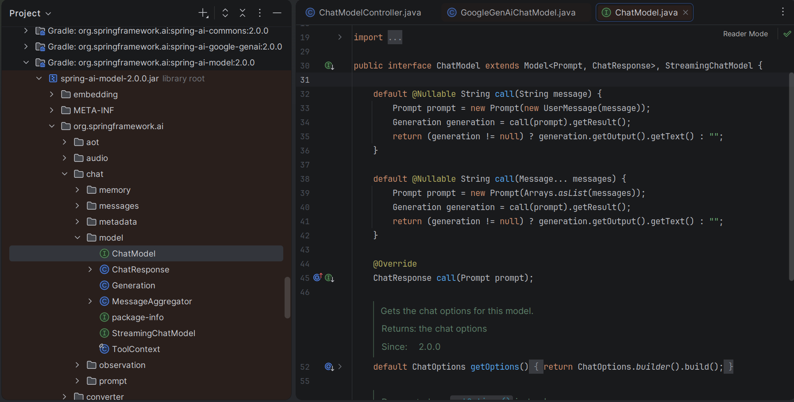

# 🟩 Detalhamento das Partes 1 e 2:
##  Passo 1 - estrutura do projeto

- Estrutura do projeto gerada pelo Spring Initializr (embutido na IDE IntelliJ).
- Escolhas do projeto (campo por campo):
    - **`Name` / nome do projeto:** `budgeting`
    - **`Language` / linguagem:** Java
    - **`Type` / ferramenta de build:** Gradle, na variante Groovy DSL (arquivo `build.gradle`, escrito na linguagem Groovy — diferente da variante Kotlin DSL, que usaria `build.gradle.kts`)
    - **`Group`:** `dio` — o identificador da "organização" do projeto, usado como prefixo de pacote
    - **`Artifact`:** `budgeting` — o nome do artefato final gerado (o `.jar`)
    - **`Package name`:** `dio.budgeting` — o pacote Java raiz, dentro do qual todas as classes do projeto vão morar
    - **`Java`:** versão 21 — uma versão **LTS** (*Long Term Support*, "suporte de longo prazo"), o que significa que ela recebe atualizações de segurança por mais tempo do que versões intermediárias, sendo uma escolha comum para projetos que vão durar

>- A estrutura do projeto foi gerada pelo `Spring Initializr` (embutido na IDE IntelliJ).
>- O nome do projeto escolhido foi `budgeting`
>- O tipo de linguagem foi Java, versão 21 LTS.
>- A ferramenta de build foi o `Gradle`, na variante `Groovy DSL` (que utiliza o arquivo `build.gradle`, escrito na linguagem `Groovy`.
>- O que é o `Gradle`:
>   - É uma ferramenta de build — responsável por automatizar tarefas como: 
>       - baixar as bibliotecas externas que o projeto precisa (chamadas de dependências)
>       - compilar o código Java para bytecode
>       - rodar os testes automatizados
>       - empacotar tudo em um arquivo .jar executável
>   - O `Gradle` é configurado através de um arquivo de script (`build.gradle`) — onde declaramos **quais dependências o projeto usa** e **como ele deve ser construído**.

## O que é o <mark style='background:#00ffff'><font color='#000000'>ecossistema</font></mark> <mark style='background:#00ffff'><font color='#000000'>Spring</font></mark>? (Conceitos essenciais)

O Spring é um um ecossistema que oferece <mark style='background:#00ffff'><font color='#000000'>soluções modulares</font></mark> para <mark style='background:#00ffff'><font color='#000000'>desenvolvimento de aplicações</font></mark> Java. Seus pilares são:

### <mark style='background:yellow'><font color='#000000'>Spring Framework</font></mark> (o <mark style='background:yellow'><font color='#000000'>núcleo</font></mark>)

- **<mark style='background:#5FFF00'><font color='black'>Inversão de Controle</font></mark> (<mark style='background:#5FFF00'><font color='black'>IoC</font></mark>) e <mark style='background:#5FFF00'><font color='black'>Injeção de Dependência</font></mark> (<mark style='background:#5FFF00'><font color='black'>DI</font></mark>)** – o container gerencia os objetos (beans), suas dependências e seu ciclo de vida, reduzindo o acoplamento entre classes. Em vez de você criar objetos com new, o Spring os fornece prontos.
- **Aspect Oriented Programming (AOP)** – permite separar preocupações transversais (logging, segurança, transações) do código de negócio, usando aspectos.
### <mark style='background:yellow'><font color='#000000'>Spring Boot</font></mark> (a camada de <mark style='background:yellow'><font color='#000000'>produtividade</font></mark>, faz a <mark style='background:yellow'><font color='#000000'>orquestração</font></mark>)

- **<mark style='background:#5FFF00'><font color='black'>Auto‑configuração</font></mark>** – detecta as bibliotecas no classpath e configura automaticamente componentes (ex.: se você adicionar <mark style='background:white'><font color='#000000'>spring-boot-starter-web</font></mark>, ele já <mark style='background:white'><font color='#000000'>configura</font></mark> o <mark style='background:white'><font color='#000000'>Tomcat</font></mark> e o <mark style='background:white'><font color='#000000'>MVC</font></mark>).
- **<mark style='background:#00ffff'><font color='#000000'>Starters</font></mark>** – dependências agregadoras que reúnem todas as bibliotecas necessárias para uma funcionalidade (ex.: spring-boot-starter-data-jpa traz JPA + Hibernate + HikariCP).
- **<mark style='background:#00ffff'><font color='#000000'>Servidor embutido</font></mark>** – a aplicação é um .jar executável com seu próprio servidor (Tomcat, Jetty, Undertow), dispensando deploy em servidores externos.
- **<mark style='background:#00ffff'><font color='#000000'>Configuração externalizada</font></mark>** – <mark style='background:white'><font color='#000000'>propriedades</font></mark> em application.properties/.yml <mark style='background:white'><font color='#000000'>podem ser sobrescritas por variáveis de ambiente</font></mark>, facilitando a implantação em diferentes ambientes.

### <mark style='background:yellow'><font color='#000000'>Spring Data</font></mark> (acesso a <mark style='background:yellow'><font color='#000000'>dados</font></mark>)    
- **Padroniza o acesso a bancos de dados relacionais** (JPA) e NoSQL (MongoDB, Redis, etc.).
- **Repositórios** – interfaces que, ao estender CrudRepository ou JpaRepository, ganham métodos CRUD prontos e a capacidade de gerar consultas a partir do nome do método (query methods).
- **Reduz drasticamente a quantidade de código boilerplate de persistência**.

### <mark style='background:yellow'><font color='#000000'>Spring AI</font></mark> (recém-adicionado ao ecossistema)
- Fornece <mark style='background:#5FFF00'><font color='black'>interfaces comuns para interagir com modelos de IA</font></mark> (Chat, Embeddings, Image Generation, etc.).
- <mark style='background:#5FFF00'><font color='black'>Suporte a Tool/Function Calling</font></mark>, permitindo que a IA execute ações concretas na aplicação.
- <mark style='background:#5FFF00'><font color='black'>Abstrai provedores</font></mark> (OpenAI, Google Gemini, Anthropic, etc.) através de starters – basta trocar a dependência e as propriedades **na maioria dos casos**. ⚠️ Ressalva confirmada na prática neste projeto: essa abstração **não é total** — algumas funcionalidades (transcrição de áudio, síntese de voz) ainda não têm interface pronta (`TranscriptionModel`/`TextToSpeechModel`) implementada para todo provedor. No caso do Gemini, especificamente, essas duas exigiram descer para classes concretas do provedor (ou até para o SDK nativo do Google, fora do Spring AI) em vez de "só trocar a dependência".


## O <mark style='background:#00ffff'><font color='#000000'>papel do Spring</font></mark> neste projeto

O  ecossistema Spring (Framework + Boot + AI) permitiu <mark style='background:#00ffff'><font color='#000000'>focar na lógica de negócio</font></mark>, deixando a infraestrutura (servidor web, conexão com LLM e injeção de dependências) a cargo da auto-configuração do Spring Boot, que a monta automaticamente a partir das dependências declaradas. No projeto budgeting isso foi usado para manter a maior parte do código relativamente independente do provedor de IA, concentrando a troca principalmente no starter e nas properties — ainda que pontos específicos (classes concretas do Gemini e ausência de abstrações para transcrição/TTS) exijam ajustes pontuais no código.

## Resumo do Passo 2 

### <mark style='background:orange'><font color='#000000'>`settings.gradle`</font></mark> - onde o projeto é declarado e nomeado

**📁 Arquivo:** `budgeting/settings.gradle` (já existe, gerado pelo Initializr)

```groovy
rootProject.name = 'budgeting'
```

- O `settings.gradle` é o arquivo onde o projeto raiz é declarado e nomeado 
— É o primeiro arquivo que o Gradle lê ao processar o build. O nome `budgeting` é usado nos logs do Gradle e, por padrão, como base para o nome do artefato gerado (o `.jar`).

### <mark style='background:orange'><font color='#000000'>`BudgetingApplication.java`</font></mark>: o ponto de entrada da aplicação

**📁 Arquivo:** `budgeting/src/main/java/dio/budgeting/BudgetingApplication.java` (já existe, gerado pelo Initializr)

```java
package dio.budgeting;

import org.springframework.boot.SpringApplication;
import org.springframework.boot.autoconfigure.SpringBootApplication;

@SpringBootApplication
public class BudgetingApplication {

    public static void main(String[] args) {
        SpringApplication.run(BudgetingApplication.class, args);
    }

}
```

Explicando, linha por linha:

- **<mark style='background:#5FFF00'><font color='black'>`package dio.budgeting;`</font></mark>** — a primeira linha de qualquer arquivo Java (fora comentários) <mark style='background:white'><font color='#000000'>declara a qual **pacote** aquela classe pertence</font></mark>. Pacotes são a forma que o Java usa para organizar classes em uma estrutura hierárquica. Em Java, o caminho de pastas de um arquivo `.java` **precisa** corresponder ao nome do seu pacote — por isso este arquivo vive em `.../java/dio/budgeting/`.
- **<mark style='background:#5FFF00'><font color='black'>`import org.springframework.boot.SpringApplication;`</font></mark>** e **<mark style='background:#5FFF00'><font color='black'>`import org.springframework.boot.autoconfigure.SpringBootApplication;`</font></mark>** — <mark style='background:white'><font color='#000000'>trazem, para o escopo deste arquivo</font></mark>, <mark style='background:white'><font color='#000000'>classes/anotações definidas em outros pacotes</font></mark>, permitindo usá-las pelo nome curto.
- **<mark style='background:#5FFF00'><font color='black'>`@SpringBootApplication`</font></mark>** — uma **<mark style='background:white'><font color='#000000'>anotação</font></mark>** (<mark style='background:white'><font color='#000000'>marca</font></mark>) que é, na verdade, um "combo" de três outras anotações, aplicadas de uma vez:
  - **`@Configuration`** — marca a classe como uma fonte válida de definições de *beans* (objetos gerenciados pelo Spring).
  - **`@EnableAutoConfiguration`** — ativa o mecanismo de **auto-configuração**: ao subir, o Spring Boot examina quais bibliotecas estão no *classpath* e configura automaticamente componentes correspondentes.
  - **`@ComponentScan`** — instrui o Spring a **varrer** o pacote `dio.budgeting` e seus subpacotes, procurando por classes marcadas com anotações de "componente" e registrá-las automaticamente.
- **`public class BudgetingApplication {`** — em Java, o nome do arquivo precisa coincidir exatamente com o nome da única classe `public` que ele contém.
- **`public static void main(String[] args) {`** — o **ponto de entrada** padrão que a JVM procura ao iniciar qualquer aplicação Java.
- **<mark style='background:#5FFF00'><font color='black'>`SpringApplication.run(BudgetingApplication.class, args);`</font></mark>** — <mark style='background:white'><font color='#000000'>inicia toda a aplicação Spring Boot</font></mark>: cria o contexto, aciona a auto-configuração, cria e injeta os *beans*, e (quando houver dependência web, o que ainda não é o caso) inicia um servidor HTTP.

### <mark style='background:orange'><font color='#000000'>`BudgetingApplicationTests.java`</font></mark>: o primeiro teste

**📁 Arquivo:** `budgeting/src/test/java/dio/budgeting/BudgetingApplicationTests.java` (já existe, gerado pelo Initializr)

```java
package dio.budgeting;

import org.junit.jupiter.api.Test;
import org.springframework.boot.test.context.SpringBootTest;

@SpringBootTest
class BudgetingApplicationTests {

    @Test
    void contextLoads() {
    }

}
```

Analisando as partes principais:

- **<mark style='background:#5FFF00'><font color='black'>`@SpringBootTest`</font></mark>** — <mark style='background:white'><font color='#000000'>sobe o **contexto completo** da aplicação Spring</font></mark> antes de rodar os testes daquela classe.
- **`@Test`** — anotação do **JUnit 5** que marca um método como um caso de teste.
- **`void contextLoads() { }`** — um método **vazio**, de propósito: o próprio ato de ele rodar sem lançar exceção já é a verificação — se algum *bean* estivesse mal configurado, o `@SpringBootTest` falharia **antes** de o corpo vazio rodar.

### Aprofundamento: o que realmente acontece com `@SpringBootTest`

Quando você anota uma classe de teste com `@SpringBootTest`, o Spring Boot **não** carrega apenas um pedaço do sistema. Ele sobe **o contexto completo da sua aplicação, tal como ela existe naquele momento** — ou seja, com todos os *beans* que já foram configurados **até aquele ponto do projeto**, nem mais, nem menos.

> **⚠️ Nota de precisão, importante para não generalizar demais:** o que exatamente "sobe" depende de quais dependências e classes já existem no projeto **naquele checkpoint específico**. Na Parte 1/2 (o momento em que `BudgetingApplicationTests` foi criado e rodado), o `build.gradle` ainda **não tinha** `spring-boot-starter-web` (só adicionado na Parte 3), nem `spring-boot-starter-data-jpa`/MySQL/Docker Compose (só adicionados na Parte 9). Isso significa que, **neste checkpoint específico**, o contexto que sobe é bem mais enxuto do que vai ser mais adiante — sem Tomcat, sem JPA, sem conexão de banco. Cada nova Parte do projeto **acrescenta mais peças** a esse contexto; o exemplo abaixo já projeta o estado **final** do projeto, útil para entender o conceito geral, mas não descreve literalmente o que acontecia neste checkpoint.

Isso significa que, nos bastidores — **no estado final do projeto** (a partir da Parte 11, quando todas as camadas já existem):

- O **Spring Framework** é acionado (IoC, DI, AOP).
- O **Spring Boot** aplica toda a auto‑configuração detectada.
- O **Spring Data** prepara os repositórios e a conexão com o banco de dados.
- O **Spring AI** instancia o `ChatClient`, o `GoogleGenAiChatModel` e todas as ferramentas associadas.

Além disso, **todos os beans já configurados até aquele ponto** são instanciados – mesmo aqueles que o teste em si nunca vai usar. No estado final do projeto, por exemplo:

- O `Tomcat` embutido é iniciado (mesmo que o teste não faça requisições HTTP) — **a partir da Parte 3**, quando `spring-boot-starter-web` entra no `build.gradle`.
- O `JpaTransactionRepository` é criado e tenta se conectar ao MySQL — **a partir da Parte 9**, quando a persistência é implementada.
- O `GoogleGenAiChatModel` tenta ler a variável `GEMINI_API_KEY` — **isso sim, já verdadeiro desde a Parte 1/2**, já que o starter do Gemini está presente desde o início.

#### Por que isso é útil?
Porque o simples fato de o contexto subir sem lançar exceções já valida, **considerando tudo que já existe até aquele checkpoint**:

- Que a configuração de todas as dependências já presentes está correta.
- Que as variáveis de ambiente necessárias (para o que já existe) estão definidas.
- Que o banco de dados está acessível (via Docker Compose, por exemplo) — **a partir da Parte 9**.
- Que não há conflitos cíclicos ou beans faltando, entre os beans já configurados.

#### Analogia prática
Pense no contexto da aplicação como um **navio cargueiro**, que vai sendo construído e equipado aos poucos, Parte a Parte.

- `@SpringBootTest` ordena: *"Preparem o navio, com tudo o que já está instalado a bordo até agora! Liguem os motores, abasteçam, carreguem os contêineres já disponíveis!"* — na Parte 1/2, isso significa um navio ainda simples, sem os motores de propulsão HTTP (Tomcat) nem o porão de carga do banco de dados (JPA/MySQL), que só serão instalados mais adiante.

- A classe de teste (`BudgetingApplicationTests`) é o **inspetor** que fica no cais. Ele não carrega a carga nem pilota o navio – apenas verifica se o navio não afundou ao ser preparado.
- O método `contextLoads()` vazio é a vistoria final: se ele roda sem exceções, o navio está pronto para navegar.

#### ⚠️ Custo: tempo e recursos
Carregar tudo isso é mais lento do que um teste isolado (unitário). Por isso, para testes mais focados, o Spring oferece *slices* de teste (como `@WebMvcTest` ou `@DataJpaTest`), que carregam apenas partes específicas do contexto.

No entanto, para o teste de sanidade inicial, o `@SpringBootTest` completo é a prática mais segura e a mais usada no dia a dia.

**Resumo final:** <mark style='background:#5FFF00'><font color='black'>`@SpringBootTest`</font></mark> <mark style='background:white'><font color='#000000'>levanta a aplicação inteira</font></mark>, com <mark style='background:white'><font color='#000000'>todos os módulos do ecossistema Spring</font></mark> e <mark style='background:white'><font color='#000000'>todos os beans</font></mark> exatamente como ela rodaria em produção. O teste apenas observa se essa subida ocorre sem erros.

### <mark style='background:orange'><font color='#000000'>`build.gradle`</font></mark>: adicionando o BOM e o starter do Gemini

-  o `build.gradle` é o script onde declaramos **<mark style='background:white'><font color='#000000'>quais dependências o projeto usa</font></mark>** e **<mark style='background:white'><font color='#000000'>como ele deve ser construído</font></mark>**.

**📁 Arquivo:** `budgeting/build.gradle` (editar — arquivo já existe, gerado pelo Initializr, mas ainda **sem** nenhuma dependência de IA)

**O que fazer:** abra o arquivo e **substitua todo o conteúdo** pelo texto abaixo (ele já incorpora as duas dependências novas que vamos explicar em seguida):

```groovy
plugins {
    id 'java'
    id 'org.springframework.boot' version '4.1.0'
    id 'io.spring.dependency-management' version '1.1.7'
}

group = 'dio'
version = '0.0.1-SNAPSHOT'
description = 'budgeting'

java {
    toolchain {
        languageVersion = JavaLanguageVersion.of(21)
    }
}

repositories {
    mavenCentral()
}

dependencies {
    implementation 'org.springframework.boot:spring-boot-starter'

    // BOM do Spring AI — centraliza as versões de todos os módulos do Spring AI entre si
    implementation platform("org.springframework.ai:spring-ai-bom:2.0.0")
```
- 👆 **<mark style='background:#5FFF00'><font color='black'>`implementation platform("org.springframework.ai:spring-ai-bom:2.0.0")`</font></mark>** 👆

  > **O que é um BOM (*Bill of Materials*), explicado do zero?** Imagine que seu projeto vai usar vários módulos diferentes de uma mesma "família" de bibliotecas — no nosso caso, vários módulos do Spring AI. Cada um tem sua própria versão, e essas **<mark style='background:white'><font color='#000000'>versões precisam ser compatíveis entre si</font></mark>**. Um BOM é, essencialmente, um "catálogo de versões compatíveis": ao importá-lo com `platform(...)`, você não precisa mais escrever a versão em cada dependência individual do Spring AI — o Gradle consulta automaticamente o BOM para descobrir qual versão usar de cada uma.
  - **<mark style='background:pink'><font color='black'>`implementation`</font></mark>** — a palavra-chave do Gradle que declara uma <mark style='background:white'><font color='#000000'>dependência necessária</font></mark> tanto para **compilar** quanto para **rodar** a aplicação.
  - **<mark style='background:pink'><font color='black'>`platform(...)`</font></mark>** — informa ao Gradle: "isto não é uma dependência de código comum, é um <mark style='background:white'><font color='#000000'>catálogo de versões</font></mark>".
  - **<mark style='background:pink'><font color='black'>`"org.springframework.ai:spring-ai-bom:2.0.0"`</font></mark>** — a coordenada completa, no formato `grupo:artefato:versão`. `2.0.0` é a **<mark style='background:white'><font color='#000000'>versão estável</font></mark>** (não é mais uma versão `-M4` de milestone, como versões anteriores do Spring AI 2.x exigiam) da geração 2.0, compatível com o Spring Boot 4.x usado aqui.

```
    // Starter da OpenAI, mantido comentado como referência ao curso original
    //  implementation 'org.springframework.ai:spring-ai-starter-model-openai'

    // Starter do Google Gemini — usado neste projeto
    implementation 'org.springframework.ai:spring-ai-starter-model-google-genai'
```
- 👆 **<mark style='background:#5FFF00'><font color='#000000'>`implementation 'org.springframework.ai:spring-ai-starter-model-google-genai'`</font></mark>** 👆
  > **O que é um *starter*, explicado do zero?** Um *starter* é um tipo especial de dependência do Spring Boot que reúne, em um único artefato: a biblioteca principal (aqui, o código que sabe se comunicar com a API do Gemini) **e** a configuração de auto-configuração correspondente (o código que, ao detectar esse *starter*, sabe automaticamente como criar e configurar os *beans* relacionados, lendo as propriedades do `application.properties`).
  - Este *starter* específico é o que, mais adiante (Parte 3), vai disponibilizar automaticamente o *bean* `GoogleGenAiChatModel`.

```
    testImplementation 'org.springframework.boot:spring-boot-starter-test'
    testRuntimeOnly 'org.junit.platform:junit-platform-launcher'
}
```
- 👆 **<mark style='background:#5FFF00'><font color='#000000'><strong>`testImplementation` / `testRuntimeOnly`</strong></font></mark>** 👆— variações de `implementation` restritas ao contexto de testes: `testImplementation` (necessária para compilar e rodar testes) e `testRuntimeOnly` (necessária só durante a execução dos testes) — já vieram assim do Initializr, sem alteração nossa.

> **💡 Dica prática (IntelliJ), guarde para usar já no próximo passo:** depois de editar `build.gradle` diretamente no arquivo, é comum o painel lateral **Gradle** do IntelliJ não refletir a mudança imediatamente, mesmo clicando no ícone de refresh. Se, ao rodar a aplicação, o `-classpath` impresso no console não contiver os `.jar`s da dependência recém-adicionada, force a resincronização: (1) pelo terminal, dentro de `budgeting/`, rode `./gradlew --refresh-dependencies build -x test`; (2) volte ao IntelliJ e sincronize o painel Gradle novamente.
```
tasks.named('test') {
    useJUnitPlatform()
}
```

### <mark style='background:orange'><font color='#000000'><strong>`application.properties`</strong></font></mark>: configurando a chave de API

**📁 Arquivo:** `budgeting/src/main/resources/application.properties` (editar)

```properties
spring.application.name=budgeting
#spring.ai.openai.api-key=${OPENAI_API_KEY}
spring.ai.google.genai.api-key=${GEMINI_API_KEY}
```

Explicando cada linha:

- **<mark style='background:#5FFF00'><font color='#000000'><strong>`spring.ai.google.genai.api-key=${GEMINI_API_KEY}`</strong></font></mark>** — a propriedade **real e ativa**. `spring.ai.google.genai` é o **prefixo de propriedade** definido pelo próprio starter do Gemini (confirmado na documentação oficial do Spring AI) — é assim que a auto-configuração sabe que este valor deve ser usado como chave de autenticação. `${GEMINI_API_KEY}` é a sintaxe de **interpolação de variável de ambiente**: o Spring, ao subir, substitui esse trecho pelo valor lido da variável de ambiente `GEMINI_API_KEY` do sistema operacional.

  > **O que é uma variável de ambiente, e por que não escrever a chave direto aqui?** Uma variável de ambiente é um valor definido no sistema operacional (ou na configuração de execução da IDE), acessível a programas em execução, mas que **não fica gravado em nenhum arquivo do projeto**. A chave de API nunca deve ser escrita diretamente em um arquivo versionado no Git — se você commitasse a chave real aqui, ela ficaria exposta permanentemente no histórico do seu repositório (mesmo que a apagasse depois), o que é especialmente arriscado em um repositório público como o seu, usado como portfólio.

### ▶️ Verificação final: rodando <mark style='background:orange'><font color='#000000'><strong>`BudgetingApplication`</strong></font></mark>

```log
Starting Gradle Daemon...
Gradle Daemon started in 2 s 120 ms
> Task :compileJava UP-TO-DATE
> Task :processResources UP-TO-DATE
> Task :classes UP-TO-DATE
> Task :compileTestJava UP-TO-DATE
> Task :processTestResources UP-TO-DATE
> Task :testClasses UP-TO-DATE
14:56:52.604 [Test worker] INFO org.springframework.test.context.support.AnnotationConfigContextLoaderUtils -- Could not detect default configuration classes for test class [dio.budgeting.BudgetingApplicationTests]: BudgetingApplicationTests does not declare any static, non-private, non-final, nested classes annotated with @Configuration.
14:56:52.791 [Test worker] INFO org.springframework.boot.test.context.SpringBootTestContextBootstrapper -- Found @SpringBootConfiguration dio.budgeting.BudgetingApplication for test class dio.budgeting.BudgetingApplicationTests
14:56:52.894 [Test worker] INFO org.springframework.test.context.support.AnnotationConfigContextLoaderUtils -- Could not detect default configuration classes for test class [dio.budgeting.BudgetingApplicationTests]: BudgetingApplicationTests does not declare any static, non-private, non-final, nested classes annotated with @Configuration.
14:56:52.896 [Test worker] INFO org.springframework.boot.test.context.SpringBootTestContextBootstrapper -- Found @SpringBootConfiguration dio.budgeting.BudgetingApplication for test class dio.budgeting.BudgetingApplicationTests

  .   ____          _            __ _ _
 /\\ / ___'_ __ _ _(_)_ __  __ _ \ \ \ \
( ( )\___ | '_ | '_| | '_ \/ _` | \ \ \ \
 \\/  ___)| |_)| | | | | || (_| |  ) ) ) )
  '  |____| .__|_| |_|_| |_\__, | / / / /
 =========|_|==============|___/=/_/_/_/

 :: Spring Boot ::                (v4.1.0)

2026-08-17T14:56:53.246-03:00  INFO 108691 --- [budgeting] [    Test worker] d.budgeting.BudgetingApplicationTests    : Starting BudgetingApplicationTests using Java 21.0.11 with PID 108691 (started by arthur in /mnt/storage_02/Backup_USB2/Backup_Github/budgeting-spring-ai-gemini/budgeting)
2026-08-17T14:56:53.248-03:00  INFO 108691 --- [budgeting] [    Test worker] d.budgeting.BudgetingApplicationTests    : No active profile set, falling back to 1 default profile: "default"
2026-08-17T14:56:54.335-03:00 DEBUG 108691 --- [budgeting] [    Test worker] o.s.a.m.t.a.ToolCallingAutoConfiguration : Cannot load class: org.springframework.security.oauth2.client.ClientAuthorizationException
2026-08-17T14:56:54.937-03:00  INFO 108691 --- [budgeting] [    Test worker] d.budgeting.BudgetingApplicationTests    : Started BudgetingApplicationTests in 1.954 seconds (process running for 3.561)
Mockito is currently self-attaching to enable the inline-mock-maker. This will no longer work in future releases of the JDK. Please add Mockito as an agent to your build as described in Mockito's documentation: https://javadoc.io/doc/org.mockito/mockito-core/latest/org.mockito/org/mockito/Mockito.html#0.3
WARNING: A Java agent has been loaded dynamically (/home/arthur/.gradle/caches/modules-2/files-2.1/net.bytebuddy/byte-buddy-agent/1.18.10/9426d28828bdcdf42666bb7a68c468279ea78f59/byte-buddy-agent-1.18.10.jar)
WARNING: If a serviceability tool is in use, please run with -XX:+EnableDynamicAgentLoading to hide this warning
WARNING: If a serviceability tool is not in use, please run with -Djdk.instrument.traceUsage for more information
WARNING: Dynamic loading of agents will be disallowed by default in a future release
OpenJDK 64-Bit Server VM warning: Sharing is only supported for boot loader classes because bootstrap classpath has been appended
> Task :test
BUILD SUCCESSFUL in 17s
5 actionable tasks: 1 executed, 4 up-to-date
Consider enabling configuration cache to speed up this build: https://docs.gradle.org/9.5.1/userguide/configuration_cache_enabling.html
14:56:56: Execution finished ':test --tests "dio.budgeting.BudgetingApplicationTests"'.
```

Ao executar <mark style='background:orange'><font color='#000000'><strong>`BudgetingApplicationTests`</strong></font></mark>, o seguinte trecho do log confirma na prática tudo o que foi explicado sobre o <mark style='background:#5FFF00'><font color='#000000'><strong>`@SpringBootTest`</strong></font></mark>:

```
Found @SpringBootConfiguration dio.budgeting.BudgetingApplication for test class ...
Started BudgetingApplicationTests in 1.954 seconds
BUILD SUCCESSFUL
```

**Interpretação linha a linha:**

1. **<mark style='background:#5FFF00'><font color='#000000'><strong>`Found @SpringBootConfiguration dio.budgeting.BudgetingApplication`</strong></font></mark>**  
   → O Spring localizou a classe principal da aplicação (`BudgetingApplication.java`), que contém a anotação `@SpringBootApplication`.

2. **<mark style='background:#5FFF00'><font color='#000000'><strong>`Started BudgetingApplicationTests in 1.954 seconds`</strong></font></mark>**  
   → O <mark style='background:white'><font color='#000000'><strong>contexto completo da aplicação foi carregado com sucesso</strong></font></mark> (Spring Framework + Boot + Data + AI, todos os beans, conexão com banco, cliente Gemini, etc.) em menos de 2 segundos.

3. **<mark style='background:#5FFF00'><font color='#000000'><strong>`BUILD SUCCESSFUL`</strong></font></mark>**  
   → O <mark style='background:white'><font color='#000000'><strong>teste</strong></font></mark> `contextLoads()` <mark style='background:white'><font color='#000000'><strong>passou</strong></font></mark>, ou seja, nenhum bean apresentou erro de configuração, nenhuma dependência ficou faltando, e a variável `GEMINI_API_KEY` estava definida corretamente.

**Observações sobre os avisos (WARNINGS) – todos normais e esperados:**

- <mark style='background:red'><font color='white'><strong>`Mockito is currently self-attaching...`</strong></font></mark> – aviso interno da biblioteca de mocks, sem impacto no teste ou na aplicação.
- <mark style='background:red'><font color='white'><strong>`WARNING: A Java agent has been loaded dynamically...`</strong></font></mark> – relacionado ao agente do Mockito, também inofensivo.
- <mark style='background:red'><font color='white'><strong>`OpenJDK 64-Bit Server VM warning: Sharing is only supported...`</strong></font></mark> – aviso do próprio JDK sobre otimização de classes, ignorável.

Nenhum desses avisos indica erro. Eles apenas refletem o ambiente de desenvolvimento (JDK 21 + Gradle) e não afetam a funcionalidade do projeto.

**Conclusão prática:**  
A execução bem‑sucedida deste teste simples (`contextLoads()`) comprova que toda a infraestrutura do ecossistema Spring (Framework, Boot, Data, AI) está corretamente configurada e que a aplicação está pronta para ser executada e testada em suas funcionalidades mais avançadas.

# 🟩 Detalhamento da Parte 3

## ChatModel: a primeira chamada a uma LLM (Vídeo 03)

### Recapitulando

Na Parte 1/2, deixamos o projeto pronto para se conectar ao Gemini (dependência resolvida, chave configurada), mas sem nenhum código que efetivamente disparasse uma chamada. Agora vamos escrever essa primeira chamada.

### Objetivo

- Entender a API de mais baixo nível do Spring AI para conversar com um modelo (`ChatModel`)
- <mark style='background:#00ffff'><font color='#000000'><strong>Validar a integração através de um **teste de integração**</strong></font></mark> (antes de qualquer coisa visível ao usuário), e <mark style='background:#00ffff'><font color='#000000'><strong>só depois expor isso como um endpoint HTTP simples</strong></font></mark>.

### Os 4 passos, em ordem

| Passo | Ação | Arquivo |
|---|---|---|
| 1 | <mark style='background:white'><font color='#000000'><strong>Editar</strong></font></mark> <mark style='background:orange'><font color='#000000'><strong>`build.gradle`</strong></font></mark> — adicionar suporte web | `budgeting/build.gradle` |
| 2 | <mark style='background:white'><font color='#000000'><strong>Editar</strong></font></mark> <mark style='background:orange'><font color='#000000'><strong>`application.properties`</strong></font></mark> — configurar modelo/temperatura/log | `budgeting/src/main/resources/application.properties` |
| 3 | <mark style='background:yellow'><font color='#000000'><strong>Criar</strong></font></mark> o <mark style='background:#00ffff'><font color='#000000'><strong>teste de integração</strong></font></mark> | `budgeting/src/test/java/dio/budgeting/GeminiChatModelIT.java` |
| 4 | <mark style='background:yellow'><font color='#000000'><strong>Criar</strong></font></mark> o <mark style='background:#00ffff'><font color='#000000'><strong>controller</strong></font></mark> | `budgeting/src/main/java/dio/budgeting/ChatModelController.java` |

A ordem importa: primeiro habilitamos web (passo 1) e configuramos o modelo (passo 2), depois **validamos com um teste** (passo 3) — só então, com a integração confirmada, escrevemos o endpoint HTTP (passo 4). Essa é a mesma lógica "testar antes de expor" que vamos repetir em quase toda Parte daqui em diante.

### A interface `ChatModel`, explicada do zero (leitura, nenhum arquivo a criar)

> ⚠️ O código abaixo **já existe pronto**, dentro do `.jar` da dependência `spring-ai-client-chat` (baixada automaticamente desde a Parte 1, via o BOM do Spring AI). Ele é mostrado aqui **só para leitura e explicação** — <mark style='background:#00ffff'><font color='#000000'><strong>é a "planta baixa" da interface que a classe</strong></font></mark> <mark style='background:#5F87FF'><font color='#000000'><strong>`GoogleGenAiChatModel`</strong></font></mark> (também já pronta, vinda do starter do Gemini) <mark style='background:#00ffff'><font color='#000000'><strong>implementa por trás</strong></font></mark>. O primeiro arquivo que você de fato cria nesta Parte é o teste do Passo 3, mais abaixo.

```java
public interface ChatModel extends Model<Prompt, ChatResponse>, StreamingChatModel {
    default String call(String message) {...}

    @Override
    ChatResponse call(Prompt prompt);
}
```

**Localizando a interface <mark style='background:#5F87FF'><font color='#000000'><strong>ChatModel</strong></font></mark>:**

<p align="center">
  
</p>

<mark style='background:#5F87FF'><font color='#000000'><strong>`ChatModel`</strong></font></mark> é a interface central do Spring AI para conversar com LLMs. Ela declara:

- **`call(String message)`** — a forma mais simples possível: você manda uma `String` de texto e recebe uma `String` de volta. Repare na palavra-chave **`default`**: significa que este método já vem com uma **implementação pronta dentro da própria interface**.
- **`call(Prompt prompt)`** — a forma completa: recebe um objeto `Prompt` e devolve um `ChatResponse`, com o texto gerado e metadados (como *tokens* consumidos). **Não** tem `default` — toda implementação concreta precisa fornecê-lo obrigatoriamente.
- **`extends Model<Prompt, ChatResponse>, StreamingChatModel`** — `ChatModel` **herda** de outras duas interfaces: `Model<Prompt, ChatResponse>` (genérica a vários tipos de modelo) e `StreamingChatModel` (que expõe um método `stream(...)`, devolvendo um `Flux<String>` — um fluxo reativo de valores chegando ao longo do tempo, útil para exibir respostas "aparecendo aos poucos"; o projeto `budgeting` nunca usa `stream(...)`, mas é bom saber que existe).

**`Prompt`**, **`Message`** (`UserMessage`, `SystemMessage`, `AssistantMessage`) e **`ChatOptions`** (incluindo `model` e `temperature`) são os demais tipos usados por essa interface — todos explicados em detalhe na seção 3.2, antes do primeiro código real que você vai escrever.

### `Prompt`, `Message`, `ChatOptions` e temperatura, explicados do zero

- **`Prompt`** — representa, de forma completa, tudo o que será enviado ao modelo: uma **lista de mensagens** e, opcionalmente, **opções de configuração**.
- **`Message`** — uma "fala" dentro da conversa: **`UserMessage`** (o que a pessoa disse), **`SystemMessage`** (instruções do desenvolvedor) e **`AssistantMessage`** (respostas já geradas pelo modelo).
- **`ChatOptions`** — parâmetros que controlam **como** o modelo gera a resposta:
  - **modelo (`model`)** — qual variante do LLM usar.
  - **temperatura (`temperature`)** — controla o quão "aleatória" é a escolha de cada próxima palavra. `0` = respostas mais previsíveis; valores mais altos = mais variação. Como o `budgeting` extrai dados estruturados (valores, categorias), a temperatura global do projeto fica em `0.0`.

### Editando <mark style='background:orange'><font color='#000000'><strong>`application.properties`</strong></font></mark> e configurando o modelo e o log

**📁 Arquivo:** `budgeting/src/main/resources/application.properties` (editar — o arquivo já existe, com as duas linhas da Parte 1/2)

**O que fazer:** **adicione** estas três linhas ao final do arquivo (não apague o que já estava lá):

```properties
spring.ai.google.genai.chat.options.model=gemini-3-flash-preview
spring.ai.google.genai.chat.options.temperature=0.0
logging.level.org.springframework.ai=DEBUG
```

**Depois desta edição, `application.properties` fica assim, completo:**

```properties
spring.application.name=budgeting
#spring.ai.openai.api-key=${OPENAI_API_KEY}
spring.ai.google.genai.api-key=${GEMINI_API_KEY}
spring.ai.google.genai.chat.options.model=gemini-3-flash-preview
spring.ai.google.genai.chat.options.temperature=0.0
logging.level.org.springframework.ai=DEBUG
```

Explicando as três linhas novas:

- **`spring.ai.google.genai.chat.options.model=gemini-3-flash-preview`** — define, globalmente, qual modelo Gemini é usado por padrão em toda chamada de chat, a menos que uma chamada específica sobrescreva isso. `gemini-3-flash-preview` é uma variante "Flash" — rápida e barata, com capacidade suficiente para extração de dados estruturados.
- **`spring.ai.google.genai.chat.options.temperature=0.0`** — a configuração global de temperatura, explicada na seção 3.2: `0.0` para maximizar consistência.
- **`logging.level.org.springframework.ai=DEBUG`** — eleva o nível de log especificamente do pacote `org.springframework.ai`, para `DEBUG`.

  > **O que são "níveis de log", explicado do zero?** Bibliotecas de log organizam mensagens por severidade/detalhe: `ERROR`, `WARN`, `INFO` (padrão), `DEBUG` (detalhes técnicos de depuração), `TRACE`. Configurar só um pacote para `DEBUG` faz esse pacote específico exibir mais detalhe, sem "poluir" o log com tudo o mais. Com isso ativo, cada requisição/resposta trocada com o Gemini passa a ser impressa no console — indispensável para depurar Tool Calling mais adiante (Parte 5).

### Criando o teste de integração `GeminiChatModelIT`

**📁 Arquivo (novo):** `budgeting/src/test/java/dio/budgeting/GeminiChatModelIT.java`

**O que fazer:** criar este arquivo novo, dentro da pasta de testes (repare que é `src/test/...`, não `src/main/...`), com este conteúdo completo:

```java
package dio.budgeting;

import org.junit.jupiter.api.Test;
import org.junit.jupiter.api.condition.EnabledIfEnvironmentVariable;
import org.springframework.ai.chat.model.ChatResponse;
import org.springframework.ai.chat.prompt.Prompt;
import org.springframework.ai.google.genai.GoogleGenAiChatModel;
import org.springframework.ai.google.genai.GoogleGenAiChatOptions;
import org.springframework.beans.factory.annotation.Autowired;
import org.springframework.boot.test.context.SpringBootTest;

import static org.assertj.core.api.Assertions.assertThat;

@SpringBootTest
@EnabledIfEnvironmentVariable(named = "GEMINI_API_KEY", matches = ".+")
public class GeminiChatModelIT {

    @Autowired
    GoogleGenAiChatModel chatModel;

    @Test
    void should_receiveResponse_when_chatModelIsCalled() {
        var options = GoogleGenAiChatOptions.builder()
                .model("gemini-3-flash-preview")
                .temperature(1.0)
                .responseMimeType("text/plain")
                .build();

        ChatResponse response = chatModel.call(new Prompt("Gere um registro de budgeting, com descricao de gasto, valor em reais e local", options));
        System.out.println("Gemini response: " + response.getResult().getOutput().getText());

        assertThat(response.getResult().getOutput().getText()).isNotEmpty();
    }

}
```

**✅ Este é o arquivo completo — não há nada a acrescentar depois.**

Explicando cada peça, na ordem em que aparece no arquivo:

- **`import static org.assertj.core.api.Assertions.assertThat;`** — um `import static` traz um **método estático específico** (`assertThat`), permitindo chamá-lo diretamente pelo nome.
- **`@SpringBootTest`** — sobe o contexto completo do Spring, incluindo a auto-configuração do starter do Gemini, que cria automaticamente o *bean* `GoogleGenAiChatModel`.
- **`@EnabledIfEnvironmentVariable(named = "GEMINI_API_KEY", matches = ".+")`** — condiciona a execução do teste à existência da variável de ambiente `GEMINI_API_KEY` não vazia (`.+` = "um ou mais caracteres quaisquer"). Sem ela, o JUnit **pula** o teste (não falha).
- **`@Autowired GoogleGenAiChatModel chatModel;`** — injeção de dependência por campo: o Spring localiza, no contexto já montado, um *bean* do tipo `GoogleGenAiChatModel` e o atribui a este campo automaticamente.
- **`GoogleGenAiChatOptions.builder()...build()`** — a primeira aparição, neste tutorial, do **padrão Builder**. Como esse padrão vai reaparecer dezenas de vezes no resto do projeto (`Prompt.builder()`, `UserMessage.builder()`, `ChatClient.builder(...)`, `Client.builder()`, e outros), vale entender agora, com calma e em detalhe, **como ler qualquer cadeia de pontos** — não só decorar que "é um Builder".

  > **A regra geral para ler qualquer cadeia de `.` (pontos), explicada do zero.** Cada `.` (ponto) significa: **"pegue o que o pedaço à esquerda devolveu, e chame um método sobre ele"**. Uma cadeia de pontos é uma sequência de **chamadas de método encadeadas**, em que o **valor de retorno** de cada chamada vira o **objeto sobre o qual a próxima chamada acontece**. A chave para entender qualquer cadeia é perguntar, a cada ponto: *"o que o pedaço à esquerda deste ponto devolveu?"* — é esse tipo devolvido que determina quais métodos você pode chamar em seguida.
  >
  > **Decompondo `GoogleGenAiChatOptions.builder().model(...).temperature(...).responseMimeType(...).build()`, passo a passo, rastreando o tipo devolvido em cada trecho:**
  >
  > | Trecho | O que devolve |
  > |---|---|
  > | `GoogleGenAiChatOptions.builder()` | Um objeto `GoogleGenAiChatOptions.Builder` — o "montador" ainda vazio |
  > | `.model("gemini-3-flash-preview")` | O **mesmo** `GoogleGenAiChatOptions.Builder`, agora já com o modelo guardado internamente |
  > | `.temperature(1.0)` | O **mesmo** `Builder` de novo, agora também com a temperatura guardada |
  > | `.responseMimeType("text/plain")` | O **mesmo** `Builder`, com os três valores já acumulados |
  > | `.build()` | **Não** mais o `Builder` — finalmente, um objeto `GoogleGenAiChatOptions` de verdade, pronto e imutável |
  >
  > Repare no padrão: cada método de configuração (`.model(...)`, `.temperature(...)`, `.responseMimeType(...)`) devolve **o próprio `Builder`**, o que é exatamente o que permite continuar encadeando mais chamadas — e só o último método, `.build()`, "quebra" esse padrão, entregando o objeto final e real.
  >
  > **De onde vem essa capacidade de encadear — o que existe, estruturalmente, por trás disso?** `Builder`, aqui, é uma **classe aninhada** (*nested class* — uma classe inteira declarada dentro do corpo de outra classe), pertencente à classe `GoogleGenAiChatOptions`. É por isso que o nome completo dela é `GoogleGenAiChatOptions.Builder`, com um ponto separando o nome da classe externa do nome da classe interna — esse ponto específico **não** é uma chamada de método, é a sintaxe do Java para navegar até uma classe aninhada. Uma estrutura simplificada (só para ilustrar a ideia, não o código-fonte exato da biblioteca) seria:
  > ```java
  > public class GoogleGenAiChatOptions {
  >     private String model;
  >     private Double temperature;
  >     // ... outros campos
  >
  >     public static class Builder {
  >         private String model;
  >         private Double temperature;
  >
  >         public Builder model(String model) {
  >             this.model = model;
  >             return this;              // devolve o próprio builder — permite continuar encadeando
  >         }
  >
  >         public Builder temperature(Double temperature) {
  >             this.temperature = temperature;
  >             return this;
  >         }
  >
  >         public GoogleGenAiChatOptions build() {
  >             return new GoogleGenAiChatOptions(this.model, this.temperature, ...);
  >         }
  >     }
  >
  >     public static Builder builder() {
  >         return new Builder();
  >     }
  > }
  > ```
  > Ou seja: `.model(...)` e `.temperature(...)` são métodos que **moram na classe `Builder`**, não na classe `GoogleGenAiChatOptions` — por isso só podem ser chamados **antes** de `.build()`, enquanto você ainda está com o "montador" em mãos, nunca depois.
  >
  > **<mark style='background:#00ffff'><font color='#000000'><strong>Por que projetar assim, em vez de um construtor comum</strong></font></mark> (`new GoogleGenAiChatOptions(modelo, temperatura, formato, ...)`)?** Porque, com um construtor comum, **todos** os parâmetros precisariam ser passados de uma vez, na ordem certa — inclusive os que você não quer configurar (seria preciso passar valores de preenchimento, tipo `null`, para cada opção não usada). <mark style='background:#00ffff'><font color='#000000'><strong>Com o *builder*, você só chama os métodos de configuração que precisa, na ordem que quiser, e o *builder* cuida de montar o objeto final corretamente</strong></font></mark>, com valores padrão sensatos para o que não foi explicitamente configurado.
  >
  > **Um contraste útil, para não confundir com outra cadeia que você já viu:** <mark style='background:red'><font color='white'><strong>nem toda cadeia de pontos é um Builder</strong></font></mark>. Compare com `chatClient.prompt().user(prompt).call().content()` (Parte 4.2) — ali, cada ponto muda de **tipo de objeto completamente** a cada passo (de uma requisição em construção, para uma resposta, para finalmente uma `String`), em vez de "acumular configuração" sobre o mesmo tipo `Builder` repetidamente. A regra geral de leitura ("o que este pedaço devolve, para eu saber o que posso chamar depois do próximo ponto?") continua a mesma nos dois casos — só muda **qual tipo específico** está sendo devolvido a cada passo da cadeia.

  - **`.model(...)`** e **`.temperature(1.0)`** — sobrescrevem, só para esta chamada, os valores globais do `application.properties` (<mark style='background:white'><font color='#000000'><strong>a temperatura sobe para `1.0` porque este teste pede à IA para **inventar** um exemplo, e alguma criatividade é aceitável aqui</strong></font></mark>).
  - **`.responseMimeType("text/plain")`** — pede resposta em texto plano.
- **`new Prompt(texto, options)`** — um construtor de `Prompt` que recebe diretamente uma `String` (convertida automaticamente em `UserMessage`) e as opções.
- **`chatModel.call(prompt)`** — a chamada de fato à API do Gemini, pela rede.
- **`response.getResult().getOutput().getText()`** — a cadeia para chegar ao texto: `getResult()` (o candidato principal) → `.getOutput()` (a mensagem gerada) → `.getText()` (o texto puro).
- **`assertThat(...).isNotEmpty()`** — usando **AssertJ**, confirma apenas que **alguma** resposta não vazia voltou — não valida o conteúdo exato (imprevisível, já que pedimos criatividade).


### ▶️ Verificação: rodando `GeminiChatModelIT`

**Rodando este teste agora**, antes de seguir para o Passo 4 (é o momento de confirmar que a integração real com o Gemini funciona).

```log
> Task :compileJava UP-TO-DATE
> Task :processResources UP-TO-DATE
> Task :classes UP-TO-DATE
> Task :compileTestJava UP-TO-DATE
> Task :processTestResources UP-TO-DATE
> Task :testClasses UP-TO-DATE
17:07:57.237 [Test worker] INFO org.springframework.test.context.support.AnnotationConfigContextLoaderUtils -- Could not detect default configuration classes for test class [dio.budgeting.GeminiChatModelIT]: GeminiChatModelIT does not declare any static, non-private, non-final, nested classes annotated with @Configuration.
17:07:57.442 [Test worker] INFO org.springframework.boot.test.context.SpringBootTestContextBootstrapper -- Found @SpringBootConfiguration dio.budgeting.BudgetingApplication for test class dio.budgeting.GeminiChatModelIT
17:07:57.526 [Test worker] INFO org.springframework.test.context.support.AnnotationConfigContextLoaderUtils -- Could not detect default configuration classes for test class [dio.budgeting.GeminiChatModelIT]: GeminiChatModelIT does not declare any static, non-private, non-final, nested classes annotated with @Configuration.
17:07:57.529 [Test worker] INFO org.springframework.boot.test.context.SpringBootTestContextBootstrapper -- Found @SpringBootConfiguration dio.budgeting.BudgetingApplication for test class dio.budgeting.GeminiChatModelIT

  .   ____          _            __ _ _
 /\\ / ___'_ __ _ _(_)_ __  __ _ \ \ \ \
( ( )\___ | '_ | '_| | '_ \/ _` | \ \ \ \
 \\/  ___)| |_)| | | | | || (_| |  ) ) ) )
  '  |____| .__|_| |_|_| |_\__, | / / / /
 =========|_|==============|___/=/_/_/_/

 :: Spring Boot ::                (v4.1.0)

2026-08-17T17:07:57.864-03:00  INFO 134606 --- [budgeting] [    Test worker] dio.budgeting.GeminiChatModelIT          : Starting GeminiChatModelIT using Java 21.0.11 with PID 134606 (started by arthur in /mnt/storage_02/Backup_USB2/Backup_Github/budgeting-spring-ai-gemini/budgeting)
2026-08-17T17:07:57.866-03:00  INFO 134606 --- [budgeting] [    Test worker] dio.budgeting.GeminiChatModelIT          : No active profile set, falling back to 1 default profile: "default"
2026-08-17T17:07:58.953-03:00 DEBUG 134606 --- [budgeting] [    Test worker] o.s.a.m.t.a.ToolCallingAutoConfiguration : Cannot load class: org.springframework.security.oauth2.client.ClientAuthorizationException
2026-08-17T17:07:59.526-03:00  INFO 134606 --- [budgeting] [    Test worker] dio.budgeting.GeminiChatModelIT          : Started GeminiChatModelIT in 1.924 seconds (process running for 3.383)
Mockito is currently self-attaching to enable the inline-mock-maker. This will no longer work in future releases of the JDK. Please add Mockito as an agent to your build as described in Mockito's documentation: https://javadoc.io/doc/org.mockito/mockito-core/latest/org.mockito/org/mockito/Mockito.html#0.3
WARNING: A Java agent has been loaded dynamically (/home/arthur/.gradle/caches/modules-2/files-2.1/net.bytebuddy/byte-buddy-agent/1.18.10/9426d28828bdcdf42666bb7a68c468279ea78f59/byte-buddy-agent-1.18.10.jar)
WARNING: If a serviceability tool is in use, please run with -XX:+EnableDynamicAgentLoading to hide this warning
WARNING: If a serviceability tool is not in use, please run with -Djdk.instrument.traceUsage for more information
WARNING: Dynamic loading of agents will be disallowed by default in a future release
Gemini response: Aqui está um modelo de registro de gastos estruturado de três formas: em tabela (ideal para Excel/Google Sheets), em lista (ideal para bloco de notas) e um modelo em branco para você copiar.

### 1. Exemplo de Registro Preenchido (Tabela)

| Data | Descrição do Gasto | Valor (R$) | Local/Estabelecimento | Categoria |
| :--- | :--- | :--- | :--- | :--- |
| 10/05 | Almoço executivo | R$ 35,00 | Restaurante Sabor Caseiro | Alimentação |
| 10/05 | Abastecimento (Gasolina) | R$ 150,00 | Posto Ipiranga | Transporte |
| 11/05 | Compras da semana | R$ 280,50 | Supermercado Extra | Mercado |
| 12/05 | Ingresso Cinema | R$ 45,00 | Shopping Iguatemi | Lazer |
| 12/05 | Café e Pão de Queijo | R$ 12,00 | Starbucks | Alimentação |

---

### 2. Formato de Lista (Simples)

*   **Gasto:** Uber para o trabalho | **Valor:** R$ 22,50 | **Local:** App Uber
*   **Gasto:** Assinatura Mensal | **Valor:** R$ 34,90 | **Local:** Netflix
*   **Gasto:** Jantar (Pizza) | **Valor:** R$ 65,00 | **Local:** Pizzaria Luigi
*   **Gasto:** Farmácia | **Valor:** R$ 42,00 | **Local:** Droga Raia

---

### 3. Modelo em Branco (Para você copiar e usar)

Você pode copiar o código abaixo para o seu bloco de notas ou planilha:

**Opção A (Texto):**
> **Data:** [ / / ]
> **Descrição:** ____________________
> **Valor:** R$ _________
> **Local:** ____________________

**Opção B (Tabela para Excel/Sheets):**
Basta copiar os cabeçalhos abaixo e colar na célula A1 da sua planilha:
`Data | Descrição | Valor (R$) | Local | Categoria`

---

### Dicas para um bom controle:
1.  **Categorize:** Adicionar uma coluna de "Categoria" (Moradia, Lazer, Saúde, Transporte) ajuda a ver para onde seu dinheiro está indo no final do mês.
2.  **Método de Pagamento:** Se quiser ser ainda mais preciso, adicione se foi no "Cartão de Crédito", "Débito" ou "Pix".
3.  **Frequência:** Tente registrar o gasto no momento em que ele ocorre para não esquecer os valores pequenos.

**Gostaria que eu montasse um arquivo CSV ou gerasse mais exemplos específicos (ex: gastos de uma viagem)?**
OpenJDK 64-Bit Server VM warning: Sharing is only supported for boot loader classes because bootstrap classpath has been appended
> Task :test
BUILD SUCCESSFUL in 23s
5 actionable tasks: 1 executed, 4 up-to-date
Consider enabling configuration cache to speed up this build: https://docs.gradle.org/9.5.1/userguide/configuration_cache_enabling.html
17:08:18: Execution finished ':test --tests "dio.budgeting.GeminiChatModelIT"'.
```

#### Análise do Log de Execução – `GeminiChatModelIT` (Parte 3)

- O log documenta a execução do teste de integração `GeminiChatModelIT`, que verifica se a aplicação consegue se comunicar com a API do Google Gemini usando a interface `ChatModel`.
- **Resultado final:** `BUILD SUCCESSFUL` – o teste passou e a resposta do Gemini foi impressa no console.

#### 🧩 Detalhamento linha a linha

##### 1. Tarefas do Gradle (compilação)
```
> Task :compileJava UP-TO-DATE
> Task :processResources UP-TO-DATE
> Task :classes UP-TO-DATE
> Task :compileTestJava UP-TO-DATE
> Task :processTestResources UP-TO-DATE
> Task :testClasses UP-TO-DATE
```
Todas as tarefas de compilação estão `UP-TO-DATE`, ou seja, **nenhum código foi alterado** desde a última execução. O Gradle reutilizou os arquivos já compilados, acelerando o processo.

---

##### 2. Inicialização do contexto Spring (para o teste)
```
INFO ... Could not detect default configuration classes for test class [dio.budgeting.GeminiChatModelIT]
INFO ... Found @SpringBootConfiguration dio.budgeting.BudgetingApplication for test class dio.budgeting.GeminiChatModelIT
```
- O Spring procura por uma classe de configuração dentro da classe de teste (não encontra, o que é normal).
- Ele **encontra a classe principal da aplicação** (`BudgetingApplication`), que contém `@SpringBootApplication`.
- Isso significa que o teste vai carregar o **contexto completo da aplicação**, exatamente como explicado na Parte 2.

---

##### 3. Banner do Spring Boot e início do teste

```
:: Spring Boot :: (v4.1.0)
2026-08-17T17:07:57.864 ... dio.budgeting.GeminiChatModelIT : Starting GeminiChatModelIT ...
2026-08-17T17:07:57.866 ... No active profile set, falling back to 1 default profile: "default"
```
- O Spring Boot inicia o contexto de teste.
- Nenhum *profile* ativo – usa o perfil `default` (configurações do `application.properties`).

##### 4. Logs da auto‑configuração do Spring AI

```
DEBUG ... o.s.a.m.t.a.ToolCallingAutoConfiguration : Cannot load class: org.springframework.security.oauth2.client.ClientAuthorizationException
```
Este é um log de `DEBUG` (ativado por `logging.level.org.springframework.ai=DEBUG` no `application.properties`). Ele apenas indica que uma classe de segurança (OAuth2) não está presente no *classpath* – **isso é esperado**, já que não estamos usando Spring Security. Não afeta o teste.

##### 5. Teste iniciado e tempo de execução

```
INFO ... Started GeminiChatModelIT in 1.924 seconds (process running for 3.383)
```
O contexto completo da aplicação foi carregado em **~1,9 segundos**. Isso inclui todos os beans (incluindo o `GoogleGenAiChatModel`, a conexão com o Gemini, etc.). O teste propriamente dito executa logo em seguida.

##### 6. Avisos (WARNINGS) – todos inofensivos

```
Mockito is currently self-attaching to enable the inline-mock-maker...
WARNING: A Java agent has been loaded dynamically...
WARNING: If a serviceability tool is in use...
WARNING: Dynamic loading of agents will be disallowed...
```
- **Mockito** está se anexando dinamicamente para habilitar o *inline-mock-maker* (usado em testes com *mocks*).
- O JDK 21 emite esses avisos sobre carregamento dinâmico de agentes Java.
- **Nenhum deles indica erro** – são apenas alertas sobre mudanças futuras no JDK.

##### 7. Saída do teste – resposta do Gemini

```
Gemini response: Aqui está um modelo de registro de gastos...
```
Esta é a **resposta gerada pelo modelo Gemini**, impressa pelo `System.out.println` no teste `should_receiveResponse_when_chatModelIsCalled()`.

O <mark style='background:#00ffff'><font color='#000000'><strong>conteúdo é um exemplo de registro de gastos, exatamente o que foi solicitado no prompt</strong></font></mark>: *"Gere um registro de budgeting, com descricao de gasto, valor em reais e local"*.

A <mark style='background:#00ffff'><font color='#000000'><strong>resposta está em português, bem formatada, com tabelas, listas e dicas</strong></font></mark> – <mark style='background:#00ffff'><font color='#000000'><strong>demonstrando que</strong></font></mark>:

- ✅ A chave de API (`GEMINI_API_KEY`) está correta.
- ✅ A comunicação com o Gemini funciona.
- ✅ O modelo está retornando texto coerente.

##### 8. Aviso do JVM

```
OpenJDK 64-Bit Server VM warning: Sharing is only supported for boot loader classes...
```
Aviso interno do JDK sobre otimização de classes compartilhadas – **ignorável**.

---

#### 9. Resultado final do Gradle

```
> Task :test
BUILD SUCCESSFUL in 23s
```
O teste executou com sucesso. O tempo total de 23 segundos inclui a inicialização do Spring, a chamada de rede para o Gemini e o processamento da resposta.

#### ✅ Conclusão

**O teste `GeminiChatModelIT` passou com sucesso**, validando que:

- O Spring Boot sobe o contexto completo.
- O bean `GoogleGenAiChatModel` é criado corretamente (a chave de API foi lida da variável de ambiente).
- A chamada ao Gemini via `ChatModel.call()` funciona e retorna uma resposta não vazia.

A saída do Gemini demonstra que a integração com o provedor de IA está **plenamente funcional**, exatamente como esperado na Parte 3 do tutorial.

# 🟩 Detalhamento da Parte 4

## `ChatClient` vs. `ChatModel`: o que muda, exatamente

O `ChatClient` **não substitui** a auto-configuração vista na Parte 3 — ele é construído **em cima** de um `ChatModel` já existente, reaproveitando toda a configuração de conexão, autenticação e opções padrão já feita.

### A qual auto-configuração isso se refere, especificamente

Refere-se ao mecanismo que **cria o *bean* `GoogleGenAiChatModel`**, explicado em detalhe na Parte 3.3/3.6. A cadeia completa:

1. O *starter* `spring-ai-starter-model-google-genai` está no `build.gradle` desde a Parte 1.6.
2. As propriedades (`spring.ai.google.genai.api-key`, `.chat.options.model`, `.chat.options.temperature`) estão no `application.properties` desde as Partes 1.7 e 3.3.
3. Quando a aplicação sobe, o **código de auto-configuração** — que vive dentro do `.jar` `spring-ai-autoconfigure-model-google-genai-2.0.0.jar` — lê essas duas fontes automaticamente e **monta o *bean* `GoogleGenAiChatModel`**, já configurado com a chave, o modelo e a temperatura, sem que você escreva `new GoogleGenAiChatModel(...)` em lugar nenhum.

**Importante deixar claro o momento em que isso acontece:** essa auto-configuração roda **uma única vez**, quando a aplicação sobe (`@SpringBootTest`, no caso dos testes). O `chatModel` chega **já pronto** a qualquer lugar que o peça — inclusive a `ChatClient.builder(chatModel)`, que **não** aciona nenhuma configuração nova: apenas recebe esse objeto já existente como parâmetro e o guarda, para usar mais tarde quando `.build()` for chamado. `ChatClient.builder(...)` embrulha um objeto pronto; não constrói nada do zero.

Prova concreta de que os dois caminhos (`ChatModel` e `ChatClient`) dependem do mesmo `GoogleGenAiChatModel` único: quando a chave `GEMINI_API_KEY` foi corrigida na Parte 3, isso resolveu **os dois** endpoints (`/api/chat-model` e `/api/chat`) na mesma correção.

### A diferença central: expressividade da API

Com o `ChatModel` puro, para configurar algo além do texto simples, era preciso montar manualmente objetos como `Prompt` e `GoogleGenAiChatOptions`. Com o `ChatClient`, existe uma **API fluente** dedicada — métodos encadeados que leem quase como uma frase — especificamente pensada para compor uma conversa com IA, incluindo: uma **mensagem de sistema** (instruções do desenvolvedor, moldando o comportamento geral do assistente), uma ou mais **mensagens de usuário** (a entrada real de quem conversa), e, como visto na Parte 5, **ferramentas** (*tools*) que o modelo pode decidir chamar. Essa simplificação acontece em **três frentes diferentes**, não só na montagem do prompt — a tabela mais adiante deixa isso explícito.

### A mesma operação, dois níveis de abstração

A mesma tarefa exata — enviar um prompt e receber o texto de resposta — implementada das duas formas:

**Com `ChatModel` puro (Parte 3.4):**

```java
var options = GoogleGenAiChatOptions.builder()
        .model("gemini-3-flash-preview")
        .temperature(1.0)
        .responseMimeType("text/plain")
        .build();

ChatResponse response = chatModel.call(
    new Prompt("Some 10 mais 20...", options)
);

String texto = response.getResult()
        .getOutput()
        .getText();
```

**Com `ChatClient` (Parte 4.2):**

```java
var chatClient = ChatClient.builder(chatModel)
        .defaultSystem("Voce é um matematico")
        .build();

String texto = chatClient
        .prompt("Some 10 mais 20...")
        .call()
        .content();
```

### Comparando ponto a ponto

| Aspecto | `ChatModel` (Parte 3.4) | `ChatClient` (Parte 4.2) |
|---|---|---|
| Linhas de código | ~7 linhas, em 3 blocos separados (opções → prompt/chamada → extração) | ~4 linhas, em uma única cadeia fluente |
| Como monta as opções | Manualmente, via `GoogleGenAiChatOptions.builder()`, objeto à parte | Não precisa — usa as opções globais do `application.properties` (Parte 3.3), a menos que você sobrescreva |
| Como define comportamento persistente ("aja como X") | Não existe — teria que reconstruir o `Prompt` inteiro, com uma `SystemMessage`, em **toda** chamada | `.defaultSystem(...)`, configurado **uma vez** no *builder*, vale para todas as chamadas seguintes |
| Como monta a mensagem | `new Prompt(texto, options)` — um construtor genérico | `.prompt("texto")` — já trata a `String` como `UserMessage` automaticamente |
| Como extrai o texto da resposta | `response.getResult().getOutput().getText()` — 3 chamadas encadeadas, navegando a estrutura de `ChatResponse` | `.content()` — 1 chamada, já devolve a `String` pronta |
| O que está "por trás", de fato executando a chamada de rede | O próprio `GoogleGenAiChatModel` (injetado direto) | O **mesmo** `GoogleGenAiChatModel` (obtido através de `ChatClient.builder(chatModel)`, já pronto, sem reconfiguração) |
| Quem criou esse `GoogleGenAiChatModel` | A auto-configuração da Parte 3.3, a partir do `build.gradle` + `application.properties` | A **mesma** auto-configuração — nenhuma configuração nova, nenhuma chave nova |

### O que significa "comportamento persistente", explicado do zero

Este é o item da tabela que merece mais atenção, porque não é apenas "sintaxe mais curta" — é uma **capacidade que o `ChatModel` puro simplesmente não tem**.

**"Persistente" aqui não tem nenhuma relação com banco de dados ou arquivo salvo em disco.** Significa: uma configuração que fica **guardada dentro do próprio objeto `ChatClient`**, e que se aplica **automaticamente a toda chamada futura** feita através dele — sem precisar ser reescrita a cada vez.

**Onde essa configuração fica guardada, mecanicamente:** quando você chama `.defaultSystem("Voce é um matematico")` durante a construção (`ChatClient.builder(chatModel).defaultSystem(...).build()`), esse texto é armazenado como parte da configuração interna **do próprio `ChatClient` resultante** — não do `chatModel` (que continua genérico, sem saber nada sobre "ser um matemático"). Cada vez que você chama `chatClient.prompt(...)` depois disso, o Spring AI monta a requisição **já partindo dessa configuração padrão**, adicionando por cima só a mensagem de usuário nova — sem que você precise informar de novo "aja como um matemático" a cada chamada.

**Contraste concreto — duas chamadas ao mesmo `ChatClient`, com e sem repetir a configuração:**

```java
var chatClient = ChatClient.builder(chatModel)
        .defaultSystem("Voce é um matematico")
        .build();

// Primeira pergunta — nenhuma menção ao "papel" do modelo é necessária aqui
String resposta1 = chatClient.prompt("Quanto é 7 vezes 8?").call().content();

// Segunda pergunta — o ChatClient "lembra" que deve continuar agindo como matemático,
// mesmo sem você repetir isso
String resposta2 = chatClient.prompt("E a raiz quadrada de 144?").call().content();
```

Em nenhuma das duas chamadas você precisou escrever de novo `"Voce é um matematico"` — essa instrução **persiste** durante toda a vida útil daquele `chatClient`, configurada uma única vez, na construção.

**O que seria necessário para reproduzir esse mesmo comportamento usando só `ChatModel` puro**, para deixar o contraste explícito:

```java
// Primeira pergunta — a mensagem de sistema precisa ser incluída manualmente
var prompt1 = new Prompt(List.of(
        new SystemMessage("Voce é um matematico"),
        new UserMessage("Quanto é 7 vezes 8?")
));
String resposta1 = chatModel.call(prompt1).getResult().getOutput().getText();

// Segunda pergunta — a MESMA mensagem de sistema precisa ser repetida de novo,
// porque cada Prompt é um objeto novo e independente, sem nenhuma "memória"
// de configuração entre uma chamada e outra
var prompt2 = new Prompt(List.of(
        new SystemMessage("Voce é um matematico"),
        new UserMessage("E a raiz quadrada de 144?")
));
String resposta2 = chatModel.call(prompt2).getResult().getOutput().getText();
```

**A diferença estrutural, resumida:** com `ChatModel`, cada `Prompt` é um pacote **autocontido e independente** — ele não "lembra" de nada da chamada anterior, e qualquer instrução de comportamento precisa ser incluída, por completo, todas as vezes. Com `ChatClient`, a configuração feita no momento da construção (`.defaultSystem(...)`, e, como visto na Parte 5, também `.defaultTools(...)`) fica **associada ao objeto `chatClient` em si**, e é reaplicada automaticamente a cada nova chamada, até que esse objeto deixe de existir.

**Por que isso importa de verdade para o projeto, e não é só conveniência de escrita:** é exatamente esse mecanismo que sustenta o assistente financeiro da Parte 11. O `TranscriptionController` monta **um único** `ChatClient`, uma única vez, no construtor, com o prompt de sistema (`"Você é um assistente financeiro..."`, vindo de `system-message.st`) e as duas *tools* de negócio (`persistTransaction`, `listTransactionsByCategory`) já configuradas ali. A partir daí, **toda** requisição de áudio que chega em `/api/ai` — sejam dez, sejam mil — reaproveita esse mesmo `chatClient` já pronto, sem precisar reconstruir o prompt de sistema nem registrar as *tools* de novo a cada chamada. Se o projeto usasse `ChatModel` puro, cada requisição teria que remontar manualmente a mensagem de sistema inteira e a lista de *tools* disponíveis, a cada nova chamada — um desperdício de código repetitivo que o `ChatClient` elimina de raiz.

### O que essa comparação deixa explícito

- **A linha "por trás" da tabela é a prova da frase original**: as duas colunas convergem no mesmo objeto (`GoogleGenAiChatModel`), criado pela mesma auto-configuração — o `ChatClient` não é uma segunda conexão com o Gemini, é uma **camada de conveniência** sobre a primeira.
- **O que o `ChatClient` "corta" não é a conexão em si, é o trabalho manual de montar/desmontar objetos** a cada chamada — `GoogleGenAiChatOptions.builder()...build()` (configuração), `new Prompt(...)` (montagem), `getResult().getOutput().getText()` (extração) somem, substituídos por uma cadeia fluente de 3 métodos (`.prompt().call().content()`).
- **`.defaultSystem(...)` é o ganho mais estrutural, não só sintático**: é a diferença entre um objeto "sem memória de configuração" (`ChatModel`, onde cada `Prompt` é isolado) e um objeto que **carrega configuração persistente entre chamadas** (`ChatClient`) — o mecanismo que torna viável, na prática, um assistente com comportamento consistente ao longo de várias interações, sem repetição de código.

### Criando o teste `GeminiChatClientIT` 

**📁 Arquivo (novo, completo):** `budgeting/src/test/java/dio/budgeting/GeminiChatClientIT.java`

```java
package dio.budgeting;

import org.junit.jupiter.api.Test;
import org.junit.jupiter.api.condition.EnabledIfEnvironmentVariable;
import org.springframework.ai.chat.client.ChatClient;
import org.springframework.ai.google.genai.GoogleGenAiChatModel;
import org.springframework.beans.factory.annotation.Autowired;
import org.springframework.boot.test.context.SpringBootTest;

import static org.assertj.core.api.AssertionsForClassTypes.assertThat;

@SpringBootTest
@EnabledIfEnvironmentVariable(named = "GEMINI_API_KEY", matches = ".+")
public class GeminiChatClientIT {
    @Autowired
    GoogleGenAiChatModel chatModel;

    @Test
    void should_executeSum_when_prompted() {
        var chatClient = ChatClient.builder(chatModel).defaultSystem("Voce é um matematico").build();

        var response = chatClient.prompt("Some 10 mais 20. Depois subtraia 30 do resultado anterior." +
                "Exiba o resultado final sem explicações")
                .call().content();

        assertThat(response).contains("0");
        System.out.println(response);
    }
}
```

Explicando cada peça:

- **`@SpringBootTest`** e **`@EnabledIfEnvironmentVariable(...)`** — já vistos na Parte 3.4: sobem o contexto completo e condicionam a execução à presença de `GEMINI_API_KEY`.
- **`@Autowired GoogleGenAiChatModel chatModel;`** — repare que este teste injeta o **`ChatModel`**, não o `ChatClient.Builder` — a estratégia aqui é diferente da que o controller vai usar no Passo 2: em vez de receber o *builder* já pronto, o teste vai construir o `ChatClient` manualmente a partir do `ChatModel` injetado, usando uma forma alternativa do método `builder`, explicada a seguir.
- **`ChatClient.builder(chatModel)`** — uma forma **estática alternativa** de obter um *builder*: em vez de `ChatClient.Builder` sendo injetado pronto pelo Spring (como veremos no controller), aqui o método estático `ChatClient.builder(...)` recebe diretamente um `ChatModel` já em mãos e devolve um *builder* configurado a partir dele. É uma forma conveniente de usar em testes, onde já se tem o `ChatModel` disponível por outro motivo (a injeção via `@Autowired`).
- **`.defaultSystem("Voce é um matematico")`** — o método do *builder* que define a **mensagem de sistema padrão** (explicada na seção 4.1): o texto passado aqui será enviado como prompt de sistema em **toda** chamada feita a partir deste `ChatClient` específico, sem precisar ser repetido a cada `.prompt(...)`. O prefixo **`default`** neste método (e em outros que veremos, como `defaultTools`, na Parte 5) sinaliza que a configuração vale para **todas** as chamadas feitas a partir deste `ChatClient`, a menos que uma chamada específica a sobrescreva explicitamente.
- **`chatClient.prompt("...")`** — uma forma **abreviada** de `chatClient.prompt().user("...")`: quando se passa uma `String` diretamente como argumento de `prompt(...)`, ela já é tratada automaticamente como a mensagem de usuário, sem precisar do `.user(...)` explícito que veremos no controller. Ambas as formas são equivalentes — a escolha de qual usar é apenas de estilo/conveniência.
- **`.call().content()`** — `.call()` dispara a chamada síncrona ao `ChatModel` por baixo; `.content()` extrai apenas o **texto** da resposta, já pronto como `String` — um atalho equivalente, em uma única chamada, à cadeia `getResult().getOutput().getText()` necessária ao trabalhar diretamente com o `ChatModel` (Parte 3.4).
- **`assertThat(response).contains("0");`** — repare no `import static` diferente do usado no teste da Parte 3.4: aqui é `org.assertj.core.api.AssertionsForClassTypes.assertThat`, em vez de `org.assertj.core.api.Assertions.assertThat`. Na prática, o efeito é o mesmo — `AssertionsForClassTypes` é uma classe interna do próprio AssertJ, focada em asserções para tipos "simples" como `String`, e a classe `Assertions` (usada no teste anterior) estende `AssertionsForClassTypes` por baixo dos panos. A diferença de qual `import` foi escolhido em cada teste reflete apenas uma sugestão automática diferente da IDE — sem impacto prático.
- **`.contains("0")`**, em vez de `.isEqualTo("0")` — esta escolha **não** é acidental: o prompt pede a soma `10 + 20 − 30 = 0`, mas mesmo pedindo explicitamente "sem explicações", o modelo pode devolver um pouco de texto ao redor do número (por exemplo, "O resultado é 0"). Um `.isEqualTo("0")` falharia nesse cenário, mesmo com a resposta numérica correta — enquanto `.contains("0")` continua validando que o resultado certo está presente em algum lugar da resposta, sem exigir uma correspondência exata de formato.

Conta que o teste valida: `10 + 20 = 30`; `30 − 30 = 0`. **Ponto importante, que motiva a Parte 5:** neste momento, é o **próprio modelo de linguagem** quem faz essa conta "de cabeça" — baseado em padrões estatísticos aprendidos durante o treinamento, não em uma operação matemática real e exata. Isso funciona razoavelmente bem para aritmética simples como esta, mas não é confiável nem verificável para operações mais complexas ou para regras de negócio precisas — como, por exemplo, garantir que um valor monetário seja registrado com exatidão. É exatamente esse problema que o **Tool Calling**, na Parte 5, resolve.

### ▶️ Verificação: rodando <mark style='background:orange'><font color='#000000'><strong>`GeminiChatClientIT`</strong></font></mark>

```log
> Task :compileJava UP-TO-DATE
> Task :processResources UP-TO-DATE
> Task :classes UP-TO-DATE
> Task :compileTestJava UP-TO-DATE
> Task :processTestResources UP-TO-DATE
> Task :testClasses UP-TO-DATE
08:37:18.330 [Test worker] INFO org.springframework.test.context.support.AnnotationConfigContextLoaderUtils -- Could not detect default configuration classes for test class [dio.budgeting.GeminiChatClientIT]: GeminiChatClientIT does not declare any static, non-private, non-final, nested classes annotated with @Configuration.
08:37:18.445 [Test worker] INFO org.springframework.boot.test.context.SpringBootTestContextBootstrapper -- Found @SpringBootConfiguration dio.budgeting.BudgetingApplication for test class dio.budgeting.GeminiChatClientIT
08:37:18.516 [Test worker] INFO org.springframework.test.context.support.AnnotationConfigContextLoaderUtils -- Could not detect default configuration classes for test class [dio.budgeting.GeminiChatClientIT]: GeminiChatClientIT does not declare any static, non-private, non-final, nested classes annotated with @Configuration.
08:37:18.519 [Test worker] INFO org.springframework.boot.test.context.SpringBootTestContextBootstrapper -- Found @SpringBootConfiguration dio.budgeting.BudgetingApplication for test class dio.budgeting.GeminiChatClientIT

  .   ____          _            __ _ _
 /\\ / ___'_ __ _ _(_)_ __  __ _ \ \ \ \
( ( )\___ | '_ | '_| | '_ \/ _` | \ \ \ \
 \\/  ___)| |_)| | | | | || (_| |  ) ) ) )
  '  |____| .__|_| |_|_| |_\__, | / / / /
 =========|_|==============|___/=/_/_/_/

 :: Spring Boot ::                (v4.1.0)

2026-08-18T08:37:18.825-03:00  INFO 26881 --- [budgeting] [    Test worker] dio.budgeting.GeminiChatClientIT         : Starting GeminiChatClientIT using Java 21.0.11 with PID 26881 (started by arthur in /mnt/storage_02/Backup_USB2/Backup_Github/budgeting-spring-ai-gemini/budgeting)
2026-08-18T08:37:18.830-03:00  INFO 26881 --- [budgeting] [    Test worker] dio.budgeting.GeminiChatClientIT         : No active profile set, falling back to 1 default profile: "default"
2026-08-18T08:37:19.786-03:00 DEBUG 26881 --- [budgeting] [    Test worker] o.s.a.m.t.a.ToolCallingAutoConfiguration : Cannot load class: org.springframework.security.oauth2.client.ClientAuthorizationException
2026-08-18T08:37:20.302-03:00  INFO 26881 --- [budgeting] [    Test worker] dio.budgeting.GeminiChatClientIT         : Started GeminiChatClientIT in 1.729 seconds (process running for 3.091)
Mockito is currently self-attaching to enable the inline-mock-maker. This will no longer work in future releases of the JDK. Please add Mockito as an agent to your build as described in Mockito's documentation: https://javadoc.io/doc/org.mockito/mockito-core/latest/org.mockito/org/mockito/Mockito.html#0.3
WARNING: A Java agent has been loaded dynamically (/home/arthur/.gradle/caches/modules-2/files-2.1/net.bytebuddy/byte-buddy-agent/1.18.10/9426d28828bdcdf42666bb7a68c468279ea78f59/byte-buddy-agent-1.18.10.jar)
WARNING: If a serviceability tool is in use, please run with -XX:+EnableDynamicAgentLoading to hide this warning
WARNING: If a serviceability tool is not in use, please run with -Djdk.instrument.traceUsage for more information
WARNING: Dynamic loading of agents will be disallowed by default in a future release
0
OpenJDK 64-Bit Server VM warning: Sharing is only supported for boot loader classes because bootstrap classpath has been appended
> Task :test
BUILD SUCCESSFUL in 9s
5 actionable tasks: 1 executed, 4 up-to-date
Consider enabling configuration cache to speed up this build: https://docs.gradle.org/9.5.1/userguide/configuration_cache_enabling.html
08:37:25: Execution finished ':test --tests "dio.budgeting.GeminiChatClientIT"'.
```

### Análise do log — `GeminiChatClientIT`

#### Bloco 1 — Tarefas do Gradle já em cache (`UP-TO-DATE`)

```
> Task :compileJava UP-TO-DATE
> Task :processResources UP-TO-DATE
> Task :classes UP-TO-DATE
> Task :compileTestJava UP-TO-DATE
> Task :processTestResources UP-TO-DATE
> Task :testClasses UP-TO-DATE
```

O Gradle constatou que nenhum arquivo-fonte mudou desde a última compilação (nem `GeminiChatClientIT.java`, nem `ChatClientController.java`, nem nenhum outro), então **reaproveitou** os `.class` já compilados, em vez de recompilar do zero — daí `UP-TO-DATE` em todas as seis tarefas iniciais. Isso é só otimização de build; não indica nada sobre o teste em si.

#### Bloco 2 — Descoberta do contexto de configuração

```
AnnotationConfigContextLoaderUtils -- Could not detect default configuration classes for test class [dio.budgeting.GeminiChatClientIT]: GeminiChatClientIT does not declare any static, non-private, non-final, nested classes annotated with @Configuration.
SpringBootTestContextBootstrapper -- Found @SpringBootConfiguration dio.budgeting.BudgetingApplication for test class dio.budgeting.GeminiChatClientIT
```

Essas duas linhas aparecem **duas vezes seguidas** no log — comportamento normal do Spring Test, relacionado à forma como ele resolve a configuração antes de efetivamente montar o contexto (uma passagem de descoberta, seguida da montagem real). O conteúdo é sempre o mesmo:
- **Primeira linha:** o Spring procura, dentro da própria classe `GeminiChatClientIT`, alguma classe de configuração aninhada e explícita (anotada com `@Configuration`) — não encontra nenhuma, porque, assim como `GeminiChatModelIT` na Parte 3, este teste não declara nenhuma.
- **Segunda linha:** sem uma configuração explícita dentro do próprio teste, o Spring recorre à busca padrão — sobe pela árvore de pacotes até encontrar a classe anotada com `@SpringBootApplication` (que, por já incluir `@Configuration` — Parte 1.3 —, também conta como fonte válida de configuração). Encontra `dio.budgeting.BudgetingApplication`, e é a partir dela que todo o contexto (incluindo a auto-configuração do `GoogleGenAiChatModel`) é montado.

#### Bloco 3 — Banner do Spring Boot e inicialização do contexto

```
2026-08-18T08:37:18.825-03:00  INFO 26881 ... dio.budgeting.GeminiChatClientIT : Starting GeminiChatClientIT using Java 21.0.11 with PID 26881
2026-08-18T08:37:18.830-03:00  INFO 26881 ... dio.budgeting.GeminiChatClientIT : No active profile set, falling back to 1 default profile: "default"
2026-08-18T08:37:19.786-03:00 DEBUG 26881 ... ToolCallingAutoConfiguration : Cannot load class: org.springframework.security.oauth2.client.ClientAuthorizationException
2026-08-18T08:37:20.302-03:00  INFO 26881 ... dio.budgeting.GeminiChatClientIT : Started GeminiChatClientIT in 1.729 seconds (process running for 3.091)
```

- **"Starting GeminiChatClientIT"** — confirma que é o **próprio teste** (não `BudgetingApplication`) quem está atuando como ponto de entrada para esta execução — comportamento característico de `@SpringBootTest`, onde a classe de teste assume esse papel durante o processo de teste.
- **"No active profile set"** — nenhum *profile* do Spring foi ativado explicitamente; usa a configuração padrão do `application.properties`, sem nenhuma variação de ambiente.
- **`ToolCallingAutoConfiguration: Cannot load class: ...ClientAuthorizationException`** — já visto em execuções anteriores (Parte 3 em diante): o Spring AI verifica, na inicialização, se uma dependência opcional de segurança OAuth2 está presente no classpath; como não está (e não precisa estar), esse aviso em nível `DEBUG` é apenas informativo, sem nenhum impacto no funcionamento — visível aqui porque `logging.level.org.springframework.ai=DEBUG` está ativo desde a Parte 3.3.
- **"Started GeminiChatClientIT in 1.729 seconds"** — o contexto completo (incluindo a auto-configuração do `GoogleGenAiChatModel`, discutida na Parte 4) subiu com sucesso, sem lançar nenhuma exceção — a primeira confirmação de que a integração básica está funcional.

#### Bloco 4 — Avisos do Mockito

```
Mockito is currently self-attaching to enable the inline-mock-maker. This will no longer work in future releases of the JDK. ...
WARNING: A Java agent has been loaded dynamically (...byte-buddy-agent-1.18.10.jar)
WARNING: If a serviceability tool is in use, please run with -XX:+EnableDynamicAgentLoading to hide this warning
WARNING: If a serviceability tool is not in use, please run with -Djdk.instrument.traceUsage for more information
WARNING: Dynamic loading of agents will be disallowed by default in a future release
```

O mesmo aviso já documentado na análise do log da Parte 3 (`GeminiChatModelIT`): o Mockito, trazido transitivamente pelo `spring-boot-starter-test`, avisa sobre uma mudança futura na forma como ele se conecta dinamicamente à JVM. Não tem relação com nenhum código escrito neste projeto — nenhum `mock` foi usado em `GeminiChatClientIT` — e não requer nenhuma ação.

#### Bloco 5 — A saída do teste em si

```
0
```

Esta é a linha mais importante do log, e a que efetivamente comprova o resultado. Corresponde ao `System.out.println(response);`, no final do método `should_executeSum_when_prompted` (Parte 4.2). O valor **`0`** confirma que:
- O `ChatClient` foi construído com sucesso a partir de `ChatClient.builder(chatModel)`.
- `.defaultSystem("Voce é um matematico")` foi aplicado.
- O prompt (`"Some 10 mais 20. Depois subtraia 30..."`) foi enviado ao Gemini através da API fluente (`.prompt(...).call().content()`).
- O modelo respondeu **exatamente** com o resultado matemático correto (`10 + 20 − 30 = 0`), sem nenhum texto adicional ao redor — desta vez o Gemini optou por uma resposta "limpa" (lembrando que a asserção `.contains("0")`, e não `.isEqualTo("0")`, existe justamente para tolerar variações, caso o modelo decidisse responder com mais texto em outra execução).

#### Bloco 6 — Aviso de compartilhamento de classes da JVM

```
OpenJDK 64-Bit Server VM warning: Sharing is only supported for boot loader classes because bootstrap classpath has been appended
```

Um aviso de baixo nível da própria JVM (não do Spring, não do projeto), relacionado a uma otimização interna de carregamento de classes (*Class Data Sharing*) que fica parcialmente desabilitada quando agentes de instrumentação (como o do Mockito, visto no Bloco 4) são carregados dinamicamente. Puramente informativo, sem efeito no resultado do teste.

#### Bloco 7 — Resultado final

```
> Task :test
BUILD SUCCESSFUL in 9s
5 actionable tasks: 1 executed, 4 up-to-date
```

`BUILD SUCCESSFUL`, sem nenhuma falha reportada — confirma que a asserção `assertThat(response).contains("0")` foi satisfeita. Combinado com a linha `0` do Bloco 5 (que já garante, por si só, que o método executou até o fim sem lançar exceção), este é o resultado esperado e correto para o teste da Parte 4.2.

#### ✅ Conclusão da análise

O resultado corresponde integralmente ao esperado pelo tutorial (Parte 4.2): o `ChatClient` foi construído com sucesso a partir do `GoogleGenAiChatModel` já auto-configurado (a mesma auto-configuração discutida no detalhamento acima), a mensagem de sistema (`.defaultSystem(...)`) foi aplicada, e o prompt matemático foi resolvido corretamente pelo Gemini, validado pela asserção `.contains("0")`. Nenhum erro, nenhuma falha — apenas avisos informativos de bibliotecas de terceiros (Mockito) e da JVM, sem relação com a lógica do teste ou do projeto.

### Criando <mark style='background:orange'><font color='#000000'><strong>`ChatClientController`</strong></font></mark>

**📁 Arquivo (novo):** `budgeting/src/main/java/dio/budgeting/ChatClientController.java`

```java
package dio.budgeting;

import org.springframework.ai.chat.client.ChatClient;
import org.springframework.web.bind.annotation.GetMapping;
import org.springframework.web.bind.annotation.RequestMapping;
import org.springframework.web.bind.annotation.RequestParam;
import org.springframework.web.bind.annotation.RestController;

@RestController
@RequestMapping("/api")
public class ChatClientController {

    private final ChatClient chatClient;

    public ChatClientController(ChatClient.Builder chatClientBuilder) {
        this.chatClient = chatClientBuilder.build();
    }

    @GetMapping("/chat")
    public String chat(@RequestParam(value = "prompt", defaultValue = "Olá!") String prompt) {
        return this.chatClient.prompt()
                .user(prompt)
                .call()
                .content();
    }
}
```

Diferente do `ChatModel` (que já vinha pronto para injeção direta, graças à auto-configuração, ao pedir `GoogleGenAiChatModel` diretamente no construtor), o `ChatClient` **não é injetado diretamente** — ele precisa ser **construído** a partir de um `ChatClient.Builder`, que **esse sim** é auto-configurado e injetável. Vamos entender por quê, e o que cada linha faz:

- **`@RestController` / `@RequestMapping("/api")`** — os mesmos já vistos na Parte 3.6, sem novidade.

- **`private final ChatClient chatClient;`** — o campo que vai guardar o `ChatClient` já configurado, `private` (só a própria classe acessa) e `final` (não é reatribuído depois de inicializado) — mesmo raciocínio de encapsulamento já explicado na Parte 3.6 para `GoogleGenAiChatModel`.

- **`public ChatClientController(ChatClient.Builder chatClientBuilder) { this.chatClient = chatClientBuilder.build(); }`** — aqui está a diferença importante em relação à Parte 3. Em vez de o construtor receber o objeto **já pronto** para usar (como acontecia com `GoogleGenAiChatModel chatModel`), ele recebe um **`ChatClient.Builder`** — um "molde" ainda não finalizado — e é o **próprio construtor** quem finaliza essa construção, chamando `.build()`.

  > **Por que o Spring não injeta o `ChatClient` já pronto, direto, como faz com o `GoogleGenAiChatModel`? Explicado do zero.** O `GoogleGenAiChatModel` é um *bean* de escopo **`singleton`** (o padrão do Spring, quando nada é dito em contrário): existe **uma única instância** dele, compartilhada por toda a aplicação — faz sentido, porque ele representa "a conexão configurada com o Gemini", e essa configuração (chave de API, modelo padrão, temperatura padrão) é a mesma para toda a aplicação, então não há motivo para duplicar esse objeto.
  >
  > O `ChatClient`, por outro lado, é pensado para ser **customizável por quem o usa** — cada classe da aplicação pode querer um `ChatClient` com um prompt de sistema diferente, ou com *tools* diferentes registradas (você vai ver isso, de forma bem concreta, na Parte 11: o `TranscriptionController` vai montar um `ChatClient` bem mais elaborado do que este, com prompt de sistema próprio e duas *tools* registradas — algo que `ChatClientController` não tem). Se o Spring injetasse um único `ChatClient` já pronto e compartilhado, **todas** as classes que o usassem ficariam presas à mesma configuração — não seria possível ter, por exemplo, "um `ChatClient` matemático" e "um `ChatClient` assistente financeiro" ao mesmo tempo, cada um com seu próprio comportamento.
  >
  > A solução do Spring AI para isso é o **`ChatClient.Builder`**, que é um *bean* de escopo **`prototype`** (diferente de `singleton`): toda vez que uma classe pede um `ChatClient.Builder` no construtor, o Spring entrega uma **instância nova e "limpa"** desse *builder* — já pré-configurada, por baixo dos panos, para usar o `GoogleGenAiChatModel` correto (o mesmo *singleton* de sempre, com a chave de API e as opções padrão), mas ainda **sem** nenhum prompt de sistema ou *tool* específica adicionada. Cada classe, então, customiza esse *builder* do seu próprio jeito, antes de chamar `.build()` — e é exatamente isso que este construtor faz: recebe o *builder* limpo e, sem nenhuma customização adicional (ainda — isso muda a partir da Parte 5), já finaliza com `.build()`.
  - **`.build()`** — finaliza a construção e devolve a instância pronta, do mesmo jeito que já vimos com `GoogleGenAiChatOptions.builder()...build()` na Parte 3.4.

  > **O que exatamente `chatClientBuilder.build()` monta aqui — e quais "valores padrão" ele carrega, com precisão.** Vale destrinchar essa pergunta, porque existem **duas camadas diferentes** de "valor padrão" envolvidas, e só uma delas está de fato presente neste `ChatClientController` específico:
  >
  > **Camada 1 — modelo e temperatura do `GoogleGenAiChatModel` (essa, sim, herdada aqui).** As propriedades já configuradas em `application.properties` (Parte 3.3):
  > ```properties
  > spring.ai.google.genai.chat.options.model=gemini-3-flash-preview
  > spring.ai.google.genai.chat.options.temperature=0.0
  > ```
  > já estavam **dentro** do `GoogleGenAiChatModel` **antes mesmo** de o `ChatClient.Builder` existir — porque, como visto acima, esse *builder* é criado **a partir** desse `GoogleGenAiChatModel` já pronto (`ChatClient.builder(chatModel)`, por trás da própria auto-configuração do Spring AI). Quando `.build()` finaliza a construção, o `ChatClient` resultante **herda** esse modelo e essa temperatura — é por isso que a resposta de `/api/chat` usa `gemini-3-flash-preview` a `0.0`, sem `ChatClientController` precisar reconfigurar nada disso.
  >
  > **Camada 2 — prompt de sistema e *tools* (essa, aqui, NÃO existe — não é "default", é "ausente").** Repare, na assinatura do construtor deste `ChatClientController` específico, que **nenhum** método de configuração é chamado entre `chatClientBuilder` e `.build()` — nem `.defaultSystem(...)`, nem `.defaultTools(...)`. O *builder* chega "limpo" (um *bean* de escopo `prototype`, recém-criado) e é finalizado **exatamente como chegou**. Isso não significa "com um prompt de sistema padrão qualquer" — significa **sem nenhum prompt de sistema**. O `ChatClient` resultante não tem nenhuma instrução de comportamento embutida, e responde de forma genérica, usando só o comportamento nativo do próprio Gemini.
  >
  > **Contraste, para deixar a diferença nítida entre as três classes que usam `ChatClient.builder(...)` ao longo do projeto:**
  >
  > | | `ChatClientController` (Parte 4.2) | `ToolCallingIT` (Parte 5.4) | `TranscriptionController` (Parte 11) |
  > |---|---|---|---|
  > | Modelo/temperatura | Herdados do `GoogleGenAiChatModel` já configurado | Idem | Idem |
  > | `.defaultSystem(...)` chamado? | **Não** | Sim — `"Voce é um matematico"` | Sim — prompt do assistente financeiro (`system-message.st`) |
  > | `.defaultTools(...)` chamado? | **Não** | Sim — `new MathTools()` | Sim — `persistTransactionUseCase`, `listTransactionsByCategoryUseCase` |
  >
  > **Resumindo:** `chatClientBuilder.build()` monta o `ChatClient`, e esse `ChatClient` carrega consigo o modelo e a temperatura já configurados via `application.properties` (herdados do `GoogleGenAiChatModel` subjacente) — isso sim é "veio pronto, sem eu especificar de novo". Mas não tem prompt de sistema nem *tools*, porque esta classe específica não chamou `.defaultSystem(...)` nem `.defaultTools(...)` antes do `.build()` — essas duas capacidades só entram em ação a partir das Partes 5 e 11, quando outras classes efetivamente as configuram.

- **`@RequestParam(value = "prompt", defaultValue = "Olá!") String prompt`** — diferente do parâmetro "cru", sem anotação, do `ChatModelController` (Parte 3.6), aqui o parâmetro de *query string* é declarado explicitamente com **`@RequestParam`**, o que permite configurar um **valor padrão**: `defaultValue = "Olá!"`. Isso significa que, se a requisição não informar `?prompt=...` na URL, o Spring usa `"Olá!"` automaticamente, em vez de devolver um erro ou um valor nulo.

- **`this.chatClient.prompt()`** — inicia a construção **fluente** de uma nova interação com o modelo — o ponto de entrada da API que dá nome ao conceito de "API fluente" explicado a seguir.

  > **O que é uma API fluente (*fluent API*), explicado do zero?** É um estilo de projeto de API em que os métodos são **encadeados** um após o outro (`objeto.metodoA().metodoB().metodoC()`), e cada método (exceto, tipicamente, o último da cadeia) devolve um novo objeto que permite continuar encadeando mais chamadas. Isso torna o código mais legível — quase como ler uma frase em linguagem natural — e evita a necessidade de criar várias variáveis intermediárias só para guardar resultados parciais.
- **`.user(prompt)`** — adiciona o texto recebido como uma mensagem do tipo **usuário** (`UserMessage`, já mencionada na Parte 3.2) a esta interação em construção.
- **`.call()`** — dispara, de fato, a chamada síncrona ao `ChatModel` que está por baixo deste `ChatClient` — o mesmo `GoogleGenAiChatModel` já configurado desde a Parte 3, só que acessado agora através da camada mais amigável do `ChatClient`.
- **`.content()`** — extrai apenas o **texto** da resposta, já pronto para uso como `String`.

**Testando manualmente**, com a aplicação rodando:

```http
GET http://localhost:8080/api/chat?prompt=Quanto é 10 mais 20?
```

```bash
curl -X GET "http://localhost:8080/api/chat?prompt=Quanto%20%C3%A9%2010%20mais%2020%3F"
```

> **Nota sobre o `curl` acima:** como o texto do prompt tem espaços e o caractere acentuado "é", eles precisam ser **codificados** para viajar dentro de uma URL (um espaço vira `%20`, o "é" vira `%C3%A9` — essa codificação chama-se *URL encoding*). Se preferir simplicidade ao testar manualmente pelo terminal, use um prompt sem acentos/espaços especiais, como `?prompt=teste`, ou teste pela barra de endereço do navegador, que faz essa codificação sozinho ao digitar normalmente.

Também é possível testar sem informar `?prompt=...` — nesse caso, o valor padrão `"Olá!"` (seção acima) é usado:

```bash
curl -X GET "http://localhost:8080/api/chat"
```

#### ✅ Resultado dos testes manuais — confirmado

```bash
curl -X GET "http://localhost:8080/api/chat?prompt=Quanto%20%C3%A9%2010%20mais%2020%3F"
10 mais 20 é igual a **30**.
```

```bash
curl -X GET "http://localhost:8080/api/chat"
Olá! Tudo bem? Como posso ajudar você hoje?
```

**Análise dos dois resultados, confirmando que corresponderam ao esperado:**

- **Primeiro `curl` (com `?prompt=...` codificado em URL):** o texto `"Quanto%20%C3%A9%2010%20mais%2020%3F"` foi corretamente decodificado pelo Tomcat/Spring de volta para `"Quanto é 10 mais 20?"` antes de chegar ao método `chat(String prompt)` — confirmando, na prática, o funcionamento do *URL encoding* explicado na nota acima. A resposta veio formatada em **markdown** (`**30**`, com negrito) — o mesmo comportamento característico do `ChatClient` já observado e documentado no teste `GeminiChatClientIT` (onde a resposta ao prompt matemático veio "limpa", só o número) e nas respostas do `ChatModelController` da Parte 3 (mais "cruas", sem formatação). Essa diferença de estilo reforça, na prática, que `/api/chat` e `/api/chat-model` são dois caminhos de código realmente distintos, mesmo reaproveitando o mesmo `GoogleGenAiChatModel` por baixo (discutido em detalhe na seção sobre auto-configuração compartilhada, acima).
- **Segundo `curl` (sem `?prompt=...`):** confirma o funcionamento do `@RequestParam(value = "prompt", defaultValue = "Olá!")` — como nenhum valor foi informado na URL, o Spring usou automaticamente `"Olá!"` como texto da mensagem de usuário, e o Gemini respondeu de forma coerente a essa saudação, sem nenhum erro de parâmetro ausente (o que aconteceria se o `defaultValue` não estivesse configurado).

Ambos os testes confirmam, de ponta a ponta: o `ChatClientController` está corretamente injetando o `ChatClient.Builder`, finalizando a construção com `.build()`, e usando a API fluente (`.prompt().user(prompt).call().content()`) para obter e devolver a resposta do Gemini como texto puro no corpo da resposta HTTP — exatamente o comportamento descrito na explicação linha a linha acima.

### ✅ Checkpoint da Parte 4 — fechado

| Item | Status |
|---|---|
| `GeminiChatClientIT` — criado, rodado e passando (confirmado via log detalhado acima) | ✅ |
| `ChatClientController` — criado, endpoint `GET /api/chat` testado manualmente com e sem parâmetro, ambos confirmados | ✅ |
| Rotas `/api/chat-model` (Parte 3) e `/api/chat` (Parte 4) coexistindo sem conflito, ambas dependentes do mesmo `GoogleGenAiChatModel` auto-configurado | ✅ |

# Detalhamento da Parte 5

## Objetivo

Substituir a "matemática de cabeça" do modelo por chamadas reais a métodos Java, introduzindo o padrão de Tool Calling em um exemplo simples e controlado, antes de aplicá-lo aos casos de uso reais do domínio (o que só acontece na Parte 8 em diante).

Esta é a Parte mais curta do tutorial em número de arquivos — de propósito. Não existe nenhum arquivo de produção aqui, nem dependência nova no build.gradle (<mark style='background:#00ffff'><font color='#000000'><strong>o suporte a</strong></font></mark> <mark style='background:orange'><font color='#000000'><strong>@Tool</strong></font></mark> <mark style='background:#00ffff'><font color='#000000'><strong>já veio, de forma transitiva, junto do starter do Gemini, desde a Parte 1</strong></font></mark>). É, intencionalmente, um "laboratório" isolado só para se aprender o mecanismo antes de aplicá-lo a algo real, na Parte 8.

## Tool Calling (Function Calling), explicado do zero, passo a passo (leitura, antes do código)

**Tool Calling** — também chamado de *Function Calling* na documentação de vários provedores — é um recurso em que <mark style='background:#00ffff'><font color='#000000'><strong>um LLM, ao processar um prompt, pode decidir que a melhor forma de responder não é gerar texto diretamente, mas **solicitar a execução de uma função/método específico**</strong></font></mark>, previamente disponibilizado pela aplicação, com argumentos que o próprio modelo extrai do contexto da conversa.

O fluxo completo, passo a passo:

1. **Declaração:** <mark style='background:#00ffff'><font color='#000000'><strong>a aplicação informa ao modelo, junto com o prompt, quais *tools* (ferramentas) estão disponíveis</strong></font></mark> — cada uma <mark style='background:#00ffff'><font color='#000000'><strong>identificada por</strong></font></mark> um **<mark style='background:#00ffff'><font color='#000000'><strong>nome</strong></font></mark>**, uma **<mark style='background:#00ffff'><font color='#000000'><strong>descrição</strong></font></mark>** (em linguagem natural, explicando o que a ferramenta faz e quando usá-la) e uma **<mark style='background:#00ffff'><font color='#000000'><strong>assinatura de parâmetros</strong></font></mark>** (quais argumentos ela espera, e de que tipo).
2. **Decisão do modelo:** <mark style='background:#00ffff'><font color='#000000'><strong>o modelo recebe o prompt do usuário e, sozinho, decide se alguma das *tools* disponíveis deveria ser chamada</strong></font></mark> para responder adequadamente — e, se sim, **com quais argumentos**, extraídos do contexto da conversa.
3. **Execução real:** este é o ponto mais importante de entender — **o modelo não executa nada por conta própria**. Ele apenas *solicita* a chamada. É a **aplicação** — no nosso caso, o Spring AI, atuando por trás do `ChatClient` — quem efetivamente localiza o método Java correspondente e o invoca de verdade.
4. **Retorno e continuação:** <mark style='background:#00ffff'><font color='#000000'><strong>o resultado dessa execução real volta para o modelo como uma nova mensagem, inserida automaticamente no histórico da conversa</strong></font></mark>. O modelo então usa esse resultado — um dado real e exato, não mais uma previsão estatística — para formular a resposta final ao usuário.

> **Por que isso resolve o problema visto na Parte 4?** Porque, <mark style='background:#00ffff'><font color='#000000'><strong>em vez do modelo "adivinhar"</strong></font></mark> o resultado de `10 + 20 − 30` com base em padrões de texto que viu durante o treinamento, ele <mark style='background:#00ffff'><font color='#000000'><strong>passa a **delegar** o cálculo para um método Java real</strong></font></mark>, que executa a operação matematicamente exata — e é esse valor exato, e não uma previsão, que retorna ao modelo para compor a resposta.

## A anotação `@Tool`, explicada do zero (leitura, antes do código)

Uma *tool* é declarada simplesmente anotando um método Java comum com `@Tool`:

```java
@Tool(description = "soma dois números inteiros, a e b")
public int sum(int a, int b) {
    return a + b;
}
```

- **`@Tool(description = "...")`** — a anotação, do pacote `org.springframework.ai.tool.annotation`, que <mark style='background:#00ffff'><font color='#000000'><strong>transforma um método Java comum em uma ferramenta disponível ao modelo</strong></font></mark>. O atributo **<mark style='background:orange'><font color='#000000'><strong>`description`</strong></font></mark>** é o elemento mais importante desta anotação: é o único texto que o modelo tem disponível para decidir **quando** e **por que** essa ferramenta deveria ser chamada. Ela <mark style='background:#00ffff'><font color='#000000'><strong>funciona como uma "bula", escrita para a IA interpretar</strong></font></mark>, não como um comentário de código para outro desenvolvedor humano ler.
- **<mark style='background:yellow'><font color='#000000'><strong>Descoberta automática de parâmetros, via reflexão.</strong></font></mark>** Repare que **não é preciso** escrever manualmente, em nenhum lugar, "o parâmetro `a` é um inteiro chamado `a`". <mark style='background:#00ffff'><font color='#000000'><strong>O Spring AI usa **reflexão**</strong></font></mark> (a capacidade da linguagem Java de examinar, em tempo de execução, a estrutura de uma classe — seus métodos, parâmetros, tipos) para descobrir automaticamente o nome de cada parâmetro e seu tipo, e a partir disso <mark style='background:#00ffff'><font color='#000000'><strong>monta, sozinho, um **esquema** enviado ao modelo junto da</strong></font></mark> <mark style='background:orange'><font color='#000000'><strong>`description`</strong></font></mark>.

### Registrando as tools no `ChatClient`: `.defaultTools(...)` (leitura, antes do código)

```java
var chatClient = ChatClient.builder(chatModel)
        .defaultSystem("Você é um matemático")
        .defaultTools(new MathTools())
        .build();
```

- **`.defaultTools(new MathTools())`** — <mark style='background:#00ffff'><font color='#000000'><strong>registra uma **instância** da classe de ferramentas</strong></font></mark> (criada com <mark style='background:orange'><font color='#000000'><strong>`new MathTools()`</strong></font></mark>) como disponível para todas as chamadas feitas a partir deste `ChatClient` específico. <mark style='background:#00ffff'><font color='#000000'><strong>O registro precisa ser feito no momento da **construção** do</strong></font></mark> <mark style='background:orange'><font color='#000000'><strong>`ChatClient`</strong></font></mark> (encadeado junto de `.build()`), via `.defaultTools(...)` — e não apenas em uma chamada específica de `.prompt(...)`.

### Criando o teste `ToolCallingIT`

**📁 Arquivo (novo):** `budgeting/src/test/java/dio/budgeting/ToolCallingIT.java`

```java
package dio.budgeting;

import org.junit.jupiter.api.Test;
import org.junit.jupiter.api.condition.EnabledIfEnvironmentVariable;
import org.springframework.ai.chat.client.ChatClient;
import org.springframework.ai.google.genai.GoogleGenAiChatModel;
import org.springframework.ai.tool.annotation.Tool;
import org.springframework.beans.factory.annotation.Autowired;
import org.springframework.boot.test.context.SpringBootTest;

import static org.assertj.core.api.AssertionsForClassTypes.assertThat;

@SpringBootTest
@EnabledIfEnvironmentVariable(named = "GEMINI_API_KEY", matches = ".+")
public class ToolCallingIT {
    @Autowired
    GoogleGenAiChatModel chatModel;

    static class MathTools {

        @Tool(description = "soma dois números inteiros, a e b")
        public int sum(int a, int b) {
            return a + b;
        }

        @Tool(description = "subtrai dois números inteiros, a e b")
        public int diff(int a, int b) {
            return a - b;
        }
    }

    @Test
    void should_executeSum_when_prompted() {
        var chatClient = ChatClient.builder(chatModel)
                .defaultSystem("Voce é um matematico")
                .defaultTools(new MathTools())
                .build();

        var response = chatClient.prompt("Some 10 mais 20. Depois subtraia 30 do resultado anterior." +
                "Exiba o resultado final sem explicações")
                .call().content();

        assertThat(response).contains("0");
        System.out.println(response);
    }
}
```

**✅ Este é o arquivo completo.**

Explicando as partes que **não** apareceram ainda nas Partes 3 e 4:

- **`static class MathTools { ... }`** — uma **classe interna estática** (*static nested class*), declarada dentro da própria classe de teste `ToolCallingIT`. A palavra-chave `static` aqui significa que essa classe interna **não precisa** de uma instância de `ToolCallingIT` para existir — ela pode ser instanciada diretamente com `new MathTools()`, independentemente de qualquer teste específico. Ela existe apenas para agrupar, localmente, as duas ferramentas de exemplo usadas neste teste — na Parte 8, você vai ver que as ferramentas "de verdade" do projeto (`PersistTransactionUseCase`, `ListTransactionsByCategoryUseCase`) não são classes internas de teste, mas classes de primeira classe do próprio pacote `application`.
- **`@Tool(description = "soma dois números inteiros, a e b")` / `@Tool(description = "subtrai dois números inteiros, a e b")`** — como explicado na seção 5.2, cada método anotado vira uma ferramenta que o modelo pode escolher chamar.
- **`ChatClient.builder(chatModel).defaultSystem("Voce é um matematico").defaultTools(new MathTools()).build()`** — a mesma construção da Parte 4.2 (`ChatClient.builder(chatModel)`, o mesmo `.defaultSystem(...)`), agora com **`.defaultTools(new MathTools())`** adicionado — a única diferença real de código em relação ao teste `GeminiChatClientIT` da Parte 4.

**Ponto crucial: essa diferença de uma linha não é visível "olhando o resultado".** O texto final devolvido pelo modelo pode até ser idêntico ao do teste da Parte 4 (`"0"`, ou uma frase contendo `"0"`) — a diferença real está no **comportamento interno**: em vez do modelo "adivinhar" a soma e a subtração a partir de padrões estatísticos de linguagem, ele agora **delega** ambas as operações para os métodos reais `sum` e `diff`, que executam a aritmética de forma exata em Java.

**Como confirmar, de fato, que a tool foi usada — e não o modelo "de cabeça"?** É aqui que a propriedade `logging.level.org.springframework.ai=DEBUG`, configurada lá na Parte 3.3, se torna útil: com ela ativa, os logs de execução deste teste mostram entradas de classes internas do Spring AI como `DefaultToolCallingManager` e `MethodToolCallback`, evidenciando as chamadas reais aos métodos `sum` e `diff` — inclusive a conversão do valor de retorno de cada um para um formato estruturado (JSON), antes de ser devolvido ao modelo, que então usa esses valores exatos (e não estimados) para compor a resposta final. Se quiser confirmar visualmente, procure por essas classes no console ao rodar o teste.

## Rodando o teste

Segue abaixo o log da execução:

```log
> Task :compileJava UP-TO-DATE
> Task :processResources UP-TO-DATE
> Task :classes UP-TO-DATE
> Task :compileTestJava UP-TO-DATE
> Task :processTestResources UP-TO-DATE
> Task :testClasses UP-TO-DATE
10:36:13.219 [Test worker] INFO org.springframework.test.context.support.AnnotationConfigContextLoaderUtils -- Could not detect default configuration classes for test class [dio.budgeting.ToolCallingIT]: ToolCallingIT does not declare any static, non-private, non-final, nested classes annotated with @Configuration.
10:36:13.409 [Test worker] INFO org.springframework.boot.test.context.SpringBootTestContextBootstrapper -- Found @SpringBootConfiguration dio.budgeting.BudgetingApplication for test class dio.budgeting.ToolCallingIT
10:36:13.493 [Test worker] INFO org.springframework.test.context.support.AnnotationConfigContextLoaderUtils -- Could not detect default configuration classes for test class [dio.budgeting.ToolCallingIT]: ToolCallingIT does not declare any static, non-private, non-final, nested classes annotated with @Configuration.
10:36:13.495 [Test worker] INFO org.springframework.boot.test.context.SpringBootTestContextBootstrapper -- Found @SpringBootConfiguration dio.budgeting.BudgetingApplication for test class dio.budgeting.ToolCallingIT

  .   ____          _            __ _ _
 /\\ / ___'_ __ _ _(_)_ __  __ _ \ \ \ \
( ( )\___ | '_ | '_| | '_ \/ _` | \ \ \ \
 \\/  ___)| |_)| | | | | || (_| |  ) ) ) )
  '  |____| .__|_| |_|_| |_\__, | / / / /
 =========|_|==============|___/=/_/_/_/

 :: Spring Boot ::                (v4.1.0)

2026-08-19T10:36:13.836-03:00  INFO 48379 --- [budgeting] [    Test worker] dio.budgeting.ToolCallingIT              : Starting ToolCallingIT using Java 21.0.11 with PID 48379 (started by arthur in /mnt/storage_02/Backup_USB2/Backup_Github/budgeting-spring-ai-gemini/budgeting)
2026-08-19T10:36:13.837-03:00  INFO 48379 --- [budgeting] [    Test worker] dio.budgeting.ToolCallingIT              : No active profile set, falling back to 1 default profile: "default"
2026-08-19T10:36:14.922-03:00 DEBUG 48379 --- [budgeting] [    Test worker] o.s.a.m.t.a.ToolCallingAutoConfiguration : Cannot load class: org.springframework.security.oauth2.client.ClientAuthorizationException
2026-08-19T10:36:15.457-03:00  INFO 48379 --- [budgeting] [    Test worker] dio.budgeting.ToolCallingIT              : Started ToolCallingIT in 1.881 seconds (process running for 3.219)
Mockito is currently self-attaching to enable the inline-mock-maker. This will no longer work in future releases of the JDK. Please add Mockito as an agent to your build as described in Mockito's documentation: https://javadoc.io/doc/org.mockito/mockito-core/latest/org.mockito/org/mockito/Mockito.html#0.3
WARNING: A Java agent has been loaded dynamically (/home/arthur/.gradle/caches/modules-2/files-2.1/net.bytebuddy/byte-buddy-agent/1.18.10/9426d28828bdcdf42666bb7a68c468279ea78f59/byte-buddy-agent-1.18.10.jar)
WARNING: If a serviceability tool is in use, please run with -XX:+EnableDynamicAgentLoading to hide this warning
WARNING: If a serviceability tool is not in use, please run with -Djdk.instrument.traceUsage for more information
WARNING: Dynamic loading of agents will be disallowed by default in a future release
2026-08-19T10:36:18.879-03:00 DEBUG 48379 --- [budgeting] [    Test worker] o.s.a.m.tool.DefaultToolCallingManager   : Executing tool call: sum
2026-08-19T10:36:18.881-03:00 DEBUG 48379 --- [budgeting] [    Test worker] o.s.ai.tool.method.MethodToolCallback    : Starting execution of tool: sum
2026-08-19T10:36:18.886-03:00 DEBUG 48379 --- [budgeting] [    Test worker] o.s.ai.tool.method.MethodToolCallback    : Successful execution of tool: sum
2026-08-19T10:36:18.887-03:00 DEBUG 48379 --- [budgeting] [    Test worker] o.s.a.t.e.DefaultToolCallResultConverter : Converting tool result to JSON.
2026-08-19T10:36:34.454-03:00 DEBUG 48379 --- [budgeting] [    Test worker] o.s.a.m.tool.DefaultToolCallingManager   : Executing tool call: diff
2026-08-19T10:36:34.454-03:00 DEBUG 48379 --- [budgeting] [    Test worker] o.s.ai.tool.method.MethodToolCallback    : Starting execution of tool: diff
2026-08-19T10:36:34.459-03:00 DEBUG 48379 --- [budgeting] [    Test worker] o.s.ai.tool.method.MethodToolCallback    : Successful execution of tool: diff
2026-08-19T10:36:34.459-03:00 DEBUG 48379 --- [budgeting] [    Test worker] o.s.a.t.e.DefaultToolCallResultConverter : Converting tool result to JSON.
0
OpenJDK 64-Bit Server VM warning: Sharing is only supported for boot loader classes because bootstrap classpath has been appended
> Task :test
BUILD SUCCESSFUL in 24s
5 actionable tasks: 1 executed, 4 up-to-date
Consider enabling configuration cache to speed up this build: https://docs.gradle.org/9.5.1/userguide/configuration_cache_enabling.html
10:36:35: Execution finished ':test --tests "dio.budgeting.ToolCallingIT"'.
```

### Análise do log — `ToolCallingIT`

#### Bloco 1 — Tarefas do Gradle em cache

```
> Task :compileJava UP-TO-DATE
...
> Task :testClasses UP-TO-DATE
```

Mesmo padrão já visto nas análises anteriores (Partes 3 e 4): nenhum arquivo-fonte mudou desde a última compilação, então o Gradle reaproveita os `.class` já existentes. Não indica nada sobre o resultado do teste em si.

#### Bloco 2 — Descoberta do contexto de configuração

```
AnnotationConfigContextLoaderUtils -- Could not detect default configuration classes for test class [dio.budgeting.ToolCallingIT]: ToolCallingIT does not declare any static, non-private, non-final, nested classes annotated with @Configuration.
SpringBootTestContextBootstrapper -- Found @SpringBootConfiguration dio.budgeting.BudgetingApplication for test class dio.budgeting.ToolCallingIT
```

O mesmo mecanismo já documentado na análise do `GeminiChatClientIT`: o Spring procura, primeiro, uma classe `@Configuration` aninhada dentro do próprio `ToolCallingIT` — não encontra nenhuma (a classe `MathTools` aninhada existe, mas **não** está anotada com `@Configuration`; é uma classe de domínio de teste, não de configuração do Spring). Sem isso, o Spring recorre à busca padrão e encontra `BudgetingApplication`, usando-a como base para montar todo o contexto.

#### Bloco 3 — Banner do Spring Boot e inicialização do contexto

```
Starting ToolCallingIT using Java 21.0.11 with PID 48379
No active profile set, falling back to 1 default profile: "default"
DEBUG ToolCallingAutoConfiguration : Cannot load class: org.springframework.security.oauth2.client.ClientAuthorizationException
Started ToolCallingIT in 1.881 seconds (process running for 3.219)
```

Idêntico, em estrutura, ao já analisado nos logs anteriores: o próprio teste assume o papel de ponto de entrada (`@SpringBootTest`); nenhum *profile* ativo; o aviso `DEBUG` sobre a classe OAuth2 ausente continua sendo apenas informativo (dependência opcional de segurança, não usada neste projeto); e o contexto completo sobe sem lançar nenhuma exceção em `1.881` segundos — a primeira confirmação de que toda a configuração básica (incluindo a auto-configuração do `GoogleGenAiChatModel`, já discutida) está correta.

#### Bloco 4 — Avisos do Mockito

Mesmo aviso já documentado nas análises anteriores — trazido transitivamente pelo `spring-boot-starter-test`, sem relação com nenhum código escrito neste teste, e sem ação necessária.

#### Bloco 5 — A evidência central: Tool Calling acontecendo de verdade

```
DEBUG DefaultToolCallingManager : Executing tool call: sum
DEBUG MethodToolCallback        : Starting execution of tool: sum
DEBUG MethodToolCallback        : Successful execution of tool: sum
DEBUG DefaultToolCallResultConverter : Converting tool result to JSON.

DEBUG DefaultToolCallingManager : Executing tool call: diff
DEBUG MethodToolCallback        : Starting execution of tool: diff
DEBUG MethodToolCallback        : Successful execution of tool: diff
DEBUG DefaultToolCallResultConverter : Converting tool result to JSON.
```

Este é o bloco mais importante de todo o log, e o motivo de a Parte 5 do tutorial insistir tanto em ativar `logging.level.org.springframework.ai=DEBUG` (Parte 3.3). Ele prova, com evidência concreta, exatamente o fluxo teórico de Tool Calling explicado na seção 5.1:

| Linha do log | Etapa do fluxo teórico (seção 5.1) |
|---|---|
| `Executing tool call: sum` | O modelo **decidiu** chamar `sum`; a aplicação está prestes a executá-la de verdade — não é o modelo quem executa |
| `Starting execution of tool: sum` | A execução real do método Java `sum(int a, int b)` está começando |
| `Successful execution of tool: sum` | `sum(10, 20)` rodou e devolveu `30` — matemática **exata**, calculada por código Java, não estimada pelo modelo |
| `Converting tool result to JSON` | O resultado (`30`) é serializado para um formato que o modelo consegue interpretar, antes de voltar para ele |
| *(sequência repetida para `diff`)* | O modelo recebeu o `30` já calculado, decidiu chamar `diff` com esse valor como entrada, e `diff(30, 30)` foi executado de verdade, devolvendo `0` |

**Um detalhe temporal que vale registrar:** entre a execução de `sum` (10:36:18) e a de `diff` (10:36:34), há um intervalo de **~15 segundos** — bem mais longo que o intervalo entre as sub-etapas de cada chamada individual (medido em milissegundos). Isso corresponde ao tempo de **rede**: depois de `sum` devolver seu resultado, essa informação precisa voltar para o Gemini (uma nova chamada HTTP, pela internet), o modelo processa esse resultado e decide chamar `diff` em seguida — esse é o tempo de ida e volta até os servidores do Google, não uma lentidão do código Java em si (que executa em milissegundos, como mostram os timestamps de `Starting`/`Successful execution`).

#### Bloco 6 — A saída do teste em si

```
0
```

O `System.out.println(response)` do teste (seção 5.4). Confirma que a resposta final do modelo — já incorporando os dois resultados **reais** obtidos via Tool Calling — foi `"0"`, exatamente o valor esperado (`10 + 20 − 30 = 0`), validando a asserção `assertThat(response).contains("0")`.

#### Bloco 7 — Aviso de compartilhamento de classes da JVM e resultado final

```
OpenJDK 64-Bit Server VM warning: Sharing is only supported for boot loader classes because bootstrap classpath has been appended
> Task :test
BUILD SUCCESSFUL in 24s
5 actionable tasks: 1 executed, 4 up-to-date
```

O aviso da JVM é o mesmo já documentado nas análises anteriores — otimização interna de carregamento de classes, sem relação com o projeto. `BUILD SUCCESSFUL`, sem nenhuma falha reportada, confirma que a asserção foi satisfeita. Vale notar a duração total (`24s`) — bem maior que os `9s` do teste `GeminiChatClientIT` (Parte 4) — coerente com o fato de este teste envolver **duas** chamadas de rede completas ao Gemini (uma para decidir e processar `sum`, outra para `diff`), em vez de uma única chamada.

### ✅ Conclusão da análise — Checkpoint da Parte 5

O resultado corresponde integralmente ao esperado pelo tutorial (Parte 5.4): diferente do teste `GeminiChatClientIT` da Parte 4 (onde não havia como comprovar, só pelo resultado, se o cálculo foi "de cabeça" ou não), este log traz **prova concreta e rastreável** de que o mecanismo de Tool Calling funcionou de ponta a ponta — as classes internas `DefaultToolCallingManager` e `MethodToolCallback` aparecem **duas vezes cada**, uma para `sum`, outra para `diff`, confirmando que:

1. O modelo decidiu, sozinho, chamar as duas ferramentas, na ordem certa (soma primeiro, subtração depois — exatamente como o prompt pedia).
2. Cada ferramenta foi executada como código Java real, não simulada.
3. O resultado de `sum` foi corretamente usado como entrada de `diff` — o encadeamento de chamadas funcionou com base em dados reais, não em suposição.

| Item | Status |
|---|---|
| `ToolCallingIT` — criado, rodado e passando | ✅ |
| Tool Calling confirmado via logs (`DefaultToolCallingManager`, `MethodToolCallback`) para **ambas** as ferramentas, em sequência correta | ✅ |

---

# Detalhamento da Parte 6

## Objetivo

Transformar um arquivo de áudio (a fala do usuário) em texto — o primeiro elo real da cadeia **Áudio → STT → Tool Calling → TTS → Áudio**.


### Visão geral desta etapa — os 3 passos, em ordem

| Passo | Ação | Arquivo/Local |
|---|---|---|
| 1 | Gravar seus próprios áudios de teste | `budgeting/src/test/resources/audio/recording-1.mp3` a `recording-6.mp3` |
| 2 | Criar o teste parametrizado | `budgeting/src/test/java/dio/budgeting/GeminiTranscriptionModelIT.java` |
| 3 | Criar o controller (versão inicial — será expandido na Parte 11) | `budgeting/src/main/java/dio/budgeting/TranscriptionController.java` |

Mesma ordem lógica das Partes anteriores: matéria-prima primeiro (Passo 1), teste depois (Passo 2), endpoint HTTP por último (Passo 3). Nenhuma dependência nova no `build.gradle` — a transcrição reaproveita o mesmo `GoogleGenAiChatModel` já configurado desde a Parte 3.

### O caminho ensinado no curso: `TranscriptionModel` (OpenAI/Whisper) — leitura, antes do código

O Spring AI define, para transcrição, uma interface dedicada:

> **⚠️ Não crie nenhum arquivo para este bloco — e, neste caso específico, você nunca vai usá-lo de fato.** Este código existe dentro do Spring AI, mas **não tem implementação para o Gemini** (é justamente o assunto desta Parte). Ele é mostrado apenas para você entender o que o curso ensina com OpenAI, antes de ver, na seção 6.4, a solução real que você vai implementar.

```java
public interface TranscriptionModel extends Model<AudioTranscriptionPrompt, AudioTranscriptionResponse> {
    AudioTranscriptionResponse call(AudioTranscriptionPrompt transcriptionPrompt);

    default String transcribe(Resource resource) {
        AudioTranscriptionPrompt prompt = new AudioTranscriptionPrompt(resource);
        return this.call(prompt).getResult().getOutput();
    }
}
```

- **`Resource`** — uma abstração do próprio Spring (não específica de IA, usada em várias partes do framework) para representar "algo que pode ser lido como uma sequência de bytes", independentemente de onde esse conteúdo realmente mora: pode ser um arquivo no disco, um arquivo dentro do *classpath* (empacotado junto do `.jar` da aplicação), um array de bytes já em memória, ou até um arquivo recém-recebido em uma requisição HTTP. É o tipo usado, ao longo de todo este projeto, para representar áudio de entrada, não importa a origem.
- **`transcribe(Resource resource)`** — um método `default` (mesmo conceito da Parte 3.1: já vem implementado dentro da própria interface) de conveniência: você passa o áudio, recebe diretamente a `String` transcrita, sem precisar montar manualmente um `AudioTranscriptionPrompt`.

No momento em que o curso ensina este conteúdo, o **único provedor suportado** pelo Spring AI para `TranscriptionModel` é a **Whisper API da OpenAI** (e sua variante equivalente no Azure OpenAI). Whisper é o modelo de reconhecimento de fala de propósito geral e multilíngue desenvolvido pela própria OpenAI. A configuração ensinada usa propriedades como (⚠️ **não adicione isto ao seu `application.properties`** — é a configuração da rota OpenAI, que seu projeto não usa; mostrado só para contraste com a seção 6.4):

```properties
spring.ai.model.audio.transcription=openai
spring.ai.openai.audio.transcription.options.model=whisper-1
spring.ai.openai.audio.transcription.options.language=pt
spring.ai.openai.audio.transcription.options.temperature=0
spring.ai.openai.audio.transcription.options.response-format=text
```

### Por que essa rota não existe no projeto Gemini — explicado com cuidado

Este é um dos dois pontos mais importantes de todo o tutorial para entender (o outro é a Parte 7). O `spring-ai-starter-model-google-genai` — o *starter* usado neste projeto desde a Parte 1 — **não implementa a interface `TranscriptionModel`**.

**Por quê?** O Gemini, ao contrário do Whisper, não é um modelo especializado *apenas* em transcrição — ele é um modelo **multimodal** de propósito geral, capaz de receber, em uma mesma conversa, combinações de **texto, imagem, áudio e vídeo**, e gerar uma resposta considerando tudo isso junto. Ou seja, dentro do ecossistema Gemini, "transcrever um áudio" não é uma API tecnicamente separada de "conversar por texto" — é apenas **uma conversa de chat comum, em que uma das mensagens contém um áudio anexado**, acompanhada de um prompt de texto pedindo explicitamente para transcrever esse áudio.

> **O que é "multimodalidade" em IA, explicado do zero?** Um modelo é dito **multimodal** quando consegue processar (ou gerar) mais de um tipo de mídia dentro da mesma interação — por exemplo, receber tanto texto quanto uma imagem, e responder considerando os dois juntos ("descreva o que há nesta foto"). Modelos "unimodais", por outro lado, são especializados em um único tipo de entrada/saída — Whisper, por exemplo, foi treinado especificamente para a tarefa de transcrição de áudio, e nada além disso.

### Passo 1 — Gravar seus próprios áudios de teste

**📁 Local:** `budgeting/src/test/resources/audio/` (pasta nova — crie-a se ainda não existir)

**O que fazer:** grave (com o celular, o gravador do computador, ou qualquer ferramenta simples) **seis áudios curtos**, em português, cada um descrevendo um gasto financeiro com um valor diferente — por exemplo, "gastei oitenta reais no mercado", "paguei quarenta reais de farmácia". Salve cada um no formato `.mp3`, nomeando-os exatamente:

```
budgeting/src/test/resources/audio/recording-1.mp3
budgeting/src/test/resources/audio/recording-2.mp3
budgeting/src/test/resources/audio/recording-3.mp3
budgeting/src/test/resources/audio/recording-4.mp3
budgeting/src/test/resources/audio/recording-5.mp3
budgeting/src/test/resources/audio/recording-6.mp3
```

**✅ Estes arquivos não vêm de lugar nenhum pronto — são a "matéria-prima" real que o teste do Passo 2 vai transcrever.** Anote, à parte, o valor que você falou em cada gravação (por exemplo, "recording-1.mp3 → falei 80 reais") — você vai precisar disso no Passo 2, para ajustar os valores esperados no teste.

### A solução adotada: <mark style='background:orange'><font color='#000000'><strong>`GoogleGenAiChatModel`</strong></font></mark> + <mark style='background:orange'><font color='#000000'><strong>`Media`</strong></font></mark> — leitura, antes do código

O projeto reaproveita o **mesmo** <mark style='background:orange'><font color='#000000'><strong>`GoogleGenAiChatModel`</strong></font></mark> já usado desde a Parte 3 para conversas normais, mas monta uma mensagem de usuário com **conteúdo multimídia** anexado, usando a classe <mark style='background:orange'><font color='#000000'><strong>`Media`</strong></font></mark> do Spring AI. Este é o padrão que você vai ver, já pronto, no teste do Passo 2 e no controller do Passo 3 — vale entender cada peça antes de criar os arquivos:

```java
private static final String TRANSCRIPTION_PROMPT = """
        Transcreva o áudio a seguir com fidelidade em português brasileiro.
        Contexto do áudio: contém descrição de gastos financeiros.
        Retorne APENAS a transcrição do áudio.
        """;

var audioMedia = new Media(MimeTypeUtils.parseMimeType("audio/mpeg"), file.getResource());

var userMessage = UserMessage.builder()
        .text(TRANSCRIPTION_PROMPT)
        .media(List.of(audioMedia))
        .build();

var prompt = Prompt.builder()
        .messages(List.of(userMessage))
        .build();

chatModel.call(prompt).getResult().getOutput().getText();
```

- **`private static final String TRANSCRIPTION_PROMPT = """...""";`** — declara uma constante de classe (`static final`, ou seja, um único valor compartilhado por todas as instâncias, que nunca muda depois de definido) contendo o texto de instrução enviado ao modelo. As três aspas duplas (`"""`) abrem um **text block** — um recurso do Java, disponível desde a versão 15, que permite escrever *strings* que ocupam várias linhas sem precisar concatenar manualmente cada uma delas com `"linha 1\n" + "linha 2\n" + ...` — o texto entre `"""` e `"""` é interpretado literalmente, preservando quebras de linha, tornando prompts longos muito mais legíveis de escrever e revisar.
- **`new Media(MimeTypeUtils.parseMimeType("audio/mpeg"), file.getResource())`** — cria um objeto `Media`, que empacota, juntos: (1) o **tipo MIME** do conteúdo anexado, e (2) o conteúdo em si, como um `Resource`.

  > **O que é um "tipo MIME", explicado do zero?** MIME (*Multipurpose Internet Mail Extensions*) é um padrão para identificar o **formato/tipo de um arquivo** através de uma string curta e padronizada, no formato `tipo/subtipo` — por exemplo, `text/plain` (texto puro, já visto na Parte 3.4), `application/json` (dados JSON), ou, aqui, `audio/mpeg` (áudio no formato MP3). Esse identificador é usado tanto em requisições/respostas HTTP quanto, como neste caso, para informar a uma IA multimodal **como interpretar** um bloco de bytes anexado — sem essa informação, o Gemini não saberia se aqueles bytes representam um áudio, uma imagem, ou outra coisa.
  - **`MimeTypeUtils.parseMimeType("audio/mpeg")`** — um método utilitário do Spring que converte a `String` `"audio/mpeg"` em um objeto `MimeType` estruturado, validando que o formato é reconhecível.
  - **`file.getResource()`** — converte o `MultipartFile` (explicado na seção 6.6) — o arquivo recebido dentro da requisição HTTP — para um `Resource`, o tipo esperado pelo construtor de `Media`.
- **`UserMessage.builder().text(TRANSCRIPTION_PROMPT).media(List.of(audioMedia)).build()`** — usa, mais uma vez, o **padrão Builder**, cuja regra geral de leitura (rastreando o que cada `.` devolve) já foi explicada em detalhe na Parte 3.4. Vale reforçar aqui, especificamente sobre `UserMessage`, porque este é o primeiro momento em que você vê o *builder* de fato combinando dois tipos de conteúdo diferentes (texto **e** mídia) na mesma cadeia.

  > **`Builder` como classe aninhada, explicado do zero, agora com o exemplo específico de `UserMessage`.** Em Java, é possível declarar uma classe **inteira** dentro do corpo de outra classe — isso é chamado de **classe aninhada** (*nested class*). O código-fonte de `UserMessage`, dentro do `.jar` do Spring AI, tem uma estrutura parecida com esta (simplificada, só para ilustrar a ideia — não é o código-fonte exato e completo da biblioteca):
  > ```java
  > public class UserMessage {
  >     private String text;
  >     private List<Media> media;
  >
  >     // ... outros campos e métodos da UserMessage em si
  >
  >     public static class Builder {
  >         private String text;
  >         private List<Media> media;
  >
  >         public Builder text(String text) {
  >             this.text = text;
  >             return this;                 // devolve o próprio builder — permite continuar encadeando
  >         }
  >
  >         public Builder media(List<Media> media) {
  >             this.media = media;
  >             return this;
  >         }
  >
  >         public UserMessage build() {
  >             // aqui, o Builder finalmente cria e devolve um UserMessage de verdade
  >             return new UserMessage(this.text, this.media);
  >         }
  >     }
  >
  >     public static Builder builder() {
  >         return new Builder();
  >     }
  > }
  > ```
  > `Builder`, aqui, é uma classe declarada **dentro** do corpo da classe `UserMessage` — por isso o nome completo dela é `UserMessage.Builder`, com um ponto separando o nome da classe externa do nome da classe interna. Esse ponto específico, no nome do tipo, **não** é uma chamada de método (diferente dos pontos na cadeia `.text(...).media(...)`) — é a sintaxe do Java para navegar até uma classe aninhada.
  >
  > Rastreando o que cada trecho da cadeia devolve, usando essa estrutura como referência:
  >
  > | Trecho | O que devolve |
  > |---|---|
  > | `UserMessage.builder()` | Chama o método estático `builder()` da classe externa `UserMessage`, que cria e devolve um `new Builder()` — o "montador" ainda vazio |
  > | `.text(TRANSCRIPTION_PROMPT)` | Chama `text(...)`, um método que **mora na classe `Builder`** — guarda o texto em `this.text` e devolve `this` (o próprio `Builder`, agora com o texto preenchido) |
  > | `.media(List.of(audioMedia))` | Chama `media(...)`, também um método da classe `Builder` — guarda a lista em `this.media` e devolve `this` de novo (o mesmo `Builder`, agora com texto **e** mídia preenchidos) |
  > | `.build()` | Chama `build()`, o método que finalmente usa `this.text` e `this.media` acumulados para construir, com `new UserMessage(...)`, o objeto real e definitivo — não mais um `Builder` |
  >
  > Ou seja: `.text(...)` e `.media(...)` só podem ser chamados **enquanto você ainda está com o `Builder` em mãos** (antes de `.build()`) justamente porque são métodos que existem **na classe `Builder`**, não na classe `UserMessage` final — depois de `.build()`, o objeto que você tem em mãos é um `UserMessage` de verdade, e `UserMessage` não tem (nem precisa ter) métodos `.text(...)`/`.media(...)` para configurar mais nada, porque já está pronto e imutável.

  E `.media(...)` é sempre **opcional**: toda vez que você usou `chatClient.prompt().user(prompt)` nas Partes 4 e 5, o Spring AI montou uma `UserMessage` só com texto, sem nunca chamar `.media(...)` — a classe já vem preparada, de fábrica, para os dois cenários. `.text(...)` adiciona o prompt de instrução (pedindo a transcrição), e `.media(List.of(audioMedia))` anexa o áudio — essa combinação, em uma única mensagem, é exatamente o que caracteriza a multimodalidade explicada na seção 6.2.
  - **`List.of(audioMedia)`** — cria uma **lista imutável** (não pode ter itens adicionados ou removidos depois de criada) contendo um único elemento, `audioMedia`. `List.of(...)` é um método de fábrica introduzido no Java moderno para criar listas pequenas e fixas de forma concisa, sem precisar instanciar explicitamente uma `ArrayList` e chamar `.add(...)` em seguida.
- **`Prompt.builder().messages(List.of(userMessage)).build()`** — monta o `Prompt` final, contendo apenas essa única mensagem multimodal, usando o mesmo padrão Builder já visto (uma forma alternativa ao construtor `new Prompt(texto, options)` usado na Parte 3.4 — aqui, com uma lista de mensagens explícita, em vez de um texto simples).
- **`chatModel.call(prompt).getResult().getOutput().getText()`** — a mesma cadeia de extração de texto já vista, em detalhe, na Parte 3.4. Repare que, do ponto de vista do código, **não há absolutamente nenhuma diferença estrutural** entre "responder normalmente a uma pergunta de texto" (Parte 3) e "transcrever um áudio" (aqui) — ambos são, para o Spring AI e para o Gemini, apenas "gerar texto a partir de uma mensagem de entrada". A única diferença está no **conteúdo** dessa mensagem de entrada (com ou sem `Media` anexada) e na instrução dada no prompt.

### Criando o teste `GeminiTranscriptionModelIT`

**📁 Arquivo (novo):** `budgeting/src/test/java/dio/budgeting/GeminiTranscriptionModelIT.java`

**O que fazer:** crie este arquivo, dentro de `src/test/...`, com este conteúdo completo. **Antes de colar**, ajuste os valores da coluna direita de cada linha do `@CsvSource` (`80 reais`, `40 reais`, etc.) para bater com o que você **de fato falou** em cada uma das suas seis gravações (Passo 1) — os valores abaixo são só um exemplo:

```java
package dio.budgeting;

import org.junit.jupiter.api.condition.EnabledIfEnvironmentVariable;
import org.junit.jupiter.params.ParameterizedTest;
import org.junit.jupiter.params.provider.CsvSource;
import org.springframework.ai.chat.messages.UserMessage;
import org.springframework.ai.chat.prompt.Prompt;
import org.springframework.ai.content.Media;
import org.springframework.ai.google.genai.GoogleGenAiChatModel;
import org.springframework.beans.factory.annotation.Autowired;
import org.springframework.boot.test.context.SpringBootTest;
import org.springframework.core.io.ClassPathResource;
import org.springframework.util.MimeTypeUtils;

import java.io.IOException;
import java.util.List;

import static org.assertj.core.api.Assertions.assertThat;

@SpringBootTest
@EnabledIfEnvironmentVariable(named = "GEMINI_API_KEY", matches = ".+")
public class GeminiTranscriptionModelIT {

    @Autowired
    private GoogleGenAiChatModel chatModel;

    @ParameterizedTest
    @CsvSource({
            "recording-1.mp3, 80 reais",
            "recording-2.mp3, 40 reais",
            "recording-3.mp3, 120 reais",
            "recording-4.mp3, 90 reais",
            "recording-5.mp3, 200 reais",
            "recording-6.mp3, 60 reais"
    })
    public void should_containExpectedKeywords_when_audioFilesAreProcessed(String fileName, String expectedKeyword) throws IOException {
        var recording = new ClassPathResource("audio/" + fileName);
        assertThat(recording.exists()).isTrue();

        var audioMedia = new Media(MimeTypeUtils.parseMimeType("audio/mpeg"), recording);

        String promptTexto = """
            Transcreva o áudio a seguir com fidelidade em português brasileiro.
            Contexto do áudio: contém descrição de gastos financeiros.
            Retorne APENAS a transcrição do áudio.
            """;

        var userMessage = UserMessage.builder().text(promptTexto).media(List.of(audioMedia)).build();
        var prompt = Prompt.builder().messages(List.of(userMessage)).build();

        var result = chatModel.call(prompt).getResult();
        assertThat(result).isNotNull();

        var output = result.getOutput();
        assertThat(output).isNotNull();

        var response = output.getText();
        assertThat(response).isNotNull().isNotEmpty();

        assertThat(response).containsIgnoringCase(expectedKeyword);
        System.out.println("Arquivo: " + fileName + " -> Transcrição: " + response);
    }
}
```

Explicando as partes novas em relação aos testes das Partes 3 a 5:

- **`@ParameterizedTest`** — em vez de escrever **seis testes** quase idênticos (um para cada arquivo de áudio de exemplo), esta anotação do JUnit 5 instrui o framework a executar o **mesmo método de teste várias vezes**, uma vez para cada linha de dados fornecida (explicada a seguir) — evitando duplicação de código de teste.
- **`@CsvSource({...})`** — a fonte de dados usada junto de `@ParameterizedTest`: cada `String` dentro das chaves representa uma **linha** de valores separados por vírgula (o formato **CSV**, *Comma-Separated Values*). Para cada linha, o JUnit injeta os valores, na ordem, como argumentos do método de teste — aqui, `fileName` recebe o nome do arquivo (por exemplo, `"recording-1.mp3"`) e `expectedKeyword` recebe a palavra-chave esperada na transcrição (`"80 reais"`).
- **`public void should_containExpectedKeywords_when_audioFilesAreProcessed(String fileName, String expectedKeyword) throws IOException`** — repare que a assinatura do método já recebe os dois parâmetros que o `@CsvSource` vai preencher a cada execução, na mesma ordem em que aparecem em cada linha do CSV. **`throws IOException`** declara que este método pode lançar essa exceção verificada (ligada a operações de entrada/saída, como ler um arquivo), sem tratá-la internamente — delegando esse tratamento para o próprio framework de testes, que sabe reportar a falha corretamente caso ela ocorra.
- **`new ClassPathResource("audio/" + fileName)`** — cria um `Resource` (mesma abstração da seção 6.1) apontando para um arquivo dentro do **classpath** — neste caso, `src/test/resources/audio/`, onde você acabou de salvar os seis áudios (Passo 1). `ClassPathResource` é uma das implementações concretas de `Resource`, especializada em localizar arquivos empacotados junto do próprio projeto (em oposição a, por exemplo, um arquivo em um caminho arbitrário do disco).
- **`assertThat(recording.exists()).isTrue();`** — uma verificação **defensiva**, feita **antes mesmo** de chamar a API do Gemini: confirma que o arquivo de áudio realmente existe no caminho esperado. Isso evita que uma falha por "arquivo não encontrado" (um problema de configuração do teste — por exemplo, um nome de arquivo digitado errado no Passo 1) seja confundida, na hora de investigar uma falha, com uma falha real de transcrição (um problema na integração com a IA) — são causas completamente diferentes, e separar essa verificação ajuda a diagnosticar rapidamente qual delas ocorreu.
- **A sequência de asserções encadeadas** (`assertThat(result).isNotNull()`, depois `assertThat(output).isNotNull()`, depois `assertThat(response).isNotNull().isNotEmpty()`) — em vez de extrair o texto final em uma única linha (como fizemos na Parte 3.4, com `.getResult().getOutput().getText()` tudo junto), este teste **quebra a cadeia em passos**, verificando a cada passo que o valor intermediário não é nulo. Essa é uma prática de teste mais robusta: se, por exemplo, `result` viesse nulo por algum motivo inesperado, o teste falharia exatamente **naquele ponto**, com uma mensagem de erro clara ("`result` era nulo"), em vez de lançar um `NullPointerException` genérico e menos informativo mais adiante, ao tentar chamar `.getOutput()` sobre um valor nulo.
- **`.containsIgnoringCase(expectedKeyword)`** — uma variante do `.contains(...)` já visto na Parte 4.2, que ignora diferenças entre maiúsculas e minúsculas ao comparar. Mais uma vez, uma asserção **flexível**, pelo mesmo motivo já discutido nas Partes anteriores: a transcrição gerada por um LLM não é garantidamente idêntica, caractere por caractere, a cada execução — o modelo poderia escrever `"80 Reais"` em vez de `"80 reais"`, por exemplo, e ambas seriam transcrições corretas.

> **Observação sobre um comportamento real dos modelos de fala, útil para você saber de antemão:** tanto no curso (com Whisper) quanto na experiência prática com o Gemini, a transcrição de **números** é um ponto historicamente sensível — o modelo pode optar por escrever um valor **por extenso** ("duzentos reais") em vez de em algarismos ("200 reais"), e isso poderia fazer uma asserção mais rígida falhar mesmo diante de uma transcrição semanticamente correta. É exatamente por isso que o prompt de transcrição é explícito ao dar contexto ao modelo sobre o domínio ("contém descrição de gastos financeiros") — essa informação extra ajuda a guiar o modelo para um formato de saída mais consistente e previsível. Se, ao rodar, algum caso falhar por esse motivo, ajuste o valor esperado no `@CsvSource` para o formato que o Gemini de fato devolveu (visível no `System.out.println` do teste), em vez de tentar forçar um formato específico.

> **📌 Caso real confirmado, para você reconhecer se acontecer com você:** ao seguir este tutorial, dois dos seis casos (correspondentes a valores maiores — "200 reais" e "60 reais") falharam exatamente por esse motivo. A investigação, feita através do relatório de testes do Gradle (explicado no quadro seguinte), revelou que o Gemini havia transcrito o áudio como:
> ```
> "Saí para jantar ontem e a conta ficou duzentos reais por pessoa."
> ```
> — uma transcrição **perfeitamente correta e fiel** ao áudio, só que com o valor por extenso. A correção foi simplesmente trocar, na linha correspondente do `@CsvSource`, `"200 reais"` por `"duzentos reais"` — sem nenhuma alteração de código. Isso não é um defeito do seu teste nem do seu código: é o comportamento normal e esperado de um modelo de linguagem gerando texto livre, e é exatamente por isso que a asserção usa `.containsIgnoringCase(...)` em vez de uma comparação exata (seção 6.5) — ela é tolerante a variações razoáveis, mas não prevê automaticamente qual formato específico o modelo vai escolher a cada execução.

> **💡 Dica prática — "No matching tests found" ao rodar um teste recém-criado.** Se, ao rodar `./gradlew test --tests "dio.budgeting.NomeDoTeste"` logo após criar o arquivo, o Gradle responder com `No matching tests found in any candidate test task`, mesmo com o `package` e o nome da classe corretos, isso costuma ser um cache de build desatualizado (o Gradle ainda não "viu" o arquivo novo). Force uma recompilação completa antes de rodar o teste de novo:
> ```bash
> ./gradlew clean compileTestJava
> ./gradlew test --tests "dio.budgeting.NomeDoTeste"
> ```
> Se `clean compileTestJava` terminar com `BUILD SUCCESSFUL`, isso também confirma, de uma vez, que o pacote, o nome da classe e todos os `import`s (incluindo `@ParameterizedTest`/`@CsvSource`, que dependem do módulo `junit-jupiter-params`, normalmente já incluído transitivamente pelo `spring-boot-starter-test`) estão corretos.

> **🔎 Como investigar a transcrição real de um caso que falhou, passo a passo.** A asserção que falha é a última do método (`assertThat(response).containsIgnoringCase(expectedKeyword);`) — como ela vem **antes** do `System.out.println`, o texto transcrito não chega a ser impresso no console para os casos que falham. Para ver o valor real, o caminho mais direto é abrir o relatório HTML que o próprio Gradle gera e aponta ao final da execução com falha (`file:///.../build/reports/tests/test/index.html`), navegar até a classe → o método → o caso específico que falhou (por exemplo, `[5] fileName = "recording-5.mp3", ...`), e ler a mensagem de erro do AssertJ na seção "Failure details" — ela sempre mostra o texto real (`"Expecting actual: ..."`) ao lado do valor esperado. Uma alternativa mais rápida, sem navegar por vários níveis de link, é abrir diretamente o arquivo XML gerado em `budgeting/build/test-results/test/TEST-NomeDoTeste.xml`, que traz todas as mensagens de falha em um único arquivo.

### **Rodando este teste agora**, antes de seguir para o Passo 3

São seis execuções (uma por linha do `@CsvSource`); confira, no relatório do JUnit (pela IDE, é a forma mais clara), que todas as seis passaram.

Resultado do processamento:

```log
> Task :compileJava UP-TO-DATE
> Task :processResources UP-TO-DATE
> Task :classes UP-TO-DATE
> Task :compileTestJava UP-TO-DATE
> Task :processTestResources UP-TO-DATE
> Task :testClasses UP-TO-DATE
15:55:09.076 [Test worker] INFO org.springframework.test.context.support.AnnotationConfigContextLoaderUtils -- Could not detect default configuration classes for test class [dio.budgeting.GeminiTranscriptionModelIT]: GeminiTranscriptionModelIT does not declare any static, non-private, non-final, nested classes annotated with @Configuration.
15:55:09.245 [Test worker] INFO org.springframework.boot.test.context.SpringBootTestContextBootstrapper -- Found @SpringBootConfiguration dio.budgeting.BudgetingApplication for test class dio.budgeting.GeminiTranscriptionModelIT
15:55:09.334 [Test worker] INFO org.springframework.test.context.support.AnnotationConfigContextLoaderUtils -- Could not detect default configuration classes for test class [dio.budgeting.GeminiTranscriptionModelIT]: GeminiTranscriptionModelIT does not declare any static, non-private, non-final, nested classes annotated with @Configuration.
15:55:09.336 [Test worker] INFO org.springframework.boot.test.context.SpringBootTestContextBootstrapper -- Found @SpringBootConfiguration dio.budgeting.BudgetingApplication for test class dio.budgeting.GeminiTranscriptionModelIT

  .   ____          _            __ _ _
 /\\ / ___'_ __ _ _(_)_ __  __ _ \ \ \ \
( ( )\___ | '_ | '_| | '_ \/ _` | \ \ \ \
 \\/  ___)| |_)| | | | | || (_| |  ) ) ) )
  '  |____| .__|_| |_|_| |_\__, | / / / /
 =========|_|==============|___/=/_/_/_/

 :: Spring Boot ::                (v4.1.0)

2026-08-20T15:55:09.718-03:00  INFO 21929 --- [budgeting] [    Test worker] d.budgeting.GeminiTranscriptionModelIT   : Starting GeminiTranscriptionModelIT using Java 21.0.11 with PID 21929 (started by arthur in /mnt/storage_02/Backup_USB2/Backup_Github/budgeting-spring-ai-gemini/budgeting)
2026-08-20T15:55:09.720-03:00  INFO 21929 --- [budgeting] [    Test worker] d.budgeting.GeminiTranscriptionModelIT   : No active profile set, falling back to 1 default profile: "default"
2026-08-20T15:55:10.742-03:00 DEBUG 21929 --- [budgeting] [    Test worker] o.s.a.m.t.a.ToolCallingAutoConfiguration : Cannot load class: org.springframework.security.oauth2.client.ClientAuthorizationException
2026-08-20T15:55:11.260-03:00  INFO 21929 --- [budgeting] [    Test worker] d.budgeting.GeminiTranscriptionModelIT   : Started GeminiTranscriptionModelIT in 1.821 seconds (process running for 3.215)
Mockito is currently self-attaching to enable the inline-mock-maker. This will no longer work in future releases of the JDK. Please add Mockito as an agent to your build as described in Mockito's documentation: https://javadoc.io/doc/org.mockito/mockito-core/latest/org.mockito/org/mockito/Mockito.html#0.3
WARNING: A Java agent has been loaded dynamically (/home/arthur/.gradle/caches/modules-2/files-2.1/net.bytebuddy/byte-buddy-agent/1.18.10/9426d28828bdcdf42666bb7a68c468279ea78f59/byte-buddy-agent-1.18.10.jar)
WARNING: If a serviceability tool is in use, please run with -XX:+EnableDynamicAgentLoading to hide this warning
WARNING: If a serviceability tool is not in use, please run with -Djdk.instrument.traceUsage for more information
WARNING: Dynamic loading of agents will be disallowed by default in a future release
Arquivo: recording-1.mp3 -> Transcrição: Fui na farmácia rapidinho e deixei 80 reais em três itens.


Expecting actual:
  "Fui comprar pão e acabei gastando R$ 40 na padaria."
to contain:
  "40 reais"
 (ignoring case)
java.lang.AssertionError: 
Expecting actual:
  "Fui comprar pão e acabei gastando R$ 40 na padaria."
to contain:
  "40 reais"
 (ignoring case)
	at dio.budgeting.GeminiTranscriptionModelIT.should_containExpectedKeywords_when_audioFilesAreProcessed(GeminiTranscriptionModelIT.java:60)

Arquivo: recording-3.mp3 -> Transcrição: Pedi um delivery agora e a conta deu 120 reais com a taxa.
Arquivo: recording-4.mp3 -> Transcrição: Fui no cinema com um combo de pipoca e gastei 90 reais sozinho.


Expecting actual:
  "Saí para jantar ontem e a conta ficou duzentos reais por pessoa."
to contain:
  "200 reais"
 (ignoring case)
java.lang.AssertionError: 
Expecting actual:
  "Saí para jantar ontem e a conta ficou duzentos reais por pessoa."
to contain:
  "200 reais"
 (ignoring case)
	at dio.budgeting.GeminiTranscriptionModelIT.should_containExpectedKeywords_when_audioFilesAreProcessed(GeminiTranscriptionModelIT.java:60)


Expecting actual:
  "Paguei sessenta reais de estacionamento hoje. Um absurdo."
to contain:
  "60 reais"
 (ignoring case)
java.lang.AssertionError: 
Expecting actual:
  "Paguei sessenta reais de estacionamento hoje. Um absurdo."
to contain:
  "60 reais"
 (ignoring case)
	at dio.budgeting.GeminiTranscriptionModelIT.should_containExpectedKeywords_when_audioFilesAreProcessed(GeminiTranscriptionModelIT.java:60)


OpenJDK 64-Bit Server VM warning: Sharing is only supported for boot loader classes because bootstrap classpath has been appended
> Task :test
GeminiTranscriptionModelIT > should_containExpectedKeywords_when_audioFilesAreProcessed(String, String) > [2] fileName = "recording-2.mp3", expectedKeyword = "40 reais" FAILED
    java.lang.AssertionError at GeminiTranscriptionModelIT.java:60
GeminiTranscriptionModelIT > should_containExpectedKeywords_when_audioFilesAreProcessed(String, String) > [5] fileName = "recording-5.mp3", expectedKeyword = "200 reais" FAILED
    java.lang.AssertionError at GeminiTranscriptionModelIT.java:60
GeminiTranscriptionModelIT > should_containExpectedKeywords_when_audioFilesAreProcessed(String, String) > [6] fileName = "recording-6.mp3", expectedKeyword = "60 reais" FAILED
    java.lang.AssertionError at GeminiTranscriptionModelIT.java:60
6 tests completed, 3 failed
> Task :test FAILED
FAILURE: Build failed with an exception.
* What went wrong:
Execution failed for task ':test'.
> There were failing tests. See the report at: file:///mnt/storage_02/Backup_USB2/Backup_Github/budgeting-spring-ai-gemini/budgeting/build/reports/tests/test/index.html
* Try:
> Run with --scan to get full insights from a Build Scan (powered by Develocity).
BUILD FAILED in 44s
5 actionable tasks: 1 executed, 4 up-to-date
```

### Análise do log — `GeminiTranscriptionModelIT`

#### Bloco 1 a 4 — Compilação, contexto e avisos, sem novidade

Os quatro primeiros blocos (tarefas `UP-TO-DATE`, descoberta do contexto de configuração via `AnnotationConfigContextLoaderUtils`/`SpringBootTestContextBootstrapper`, banner do Spring Boot com o contexto subindo em `1.821` segundos sem exceções, e os avisos do Mockito) seguem exatamente o mesmo padrão já documentado nas análises anteriores (`GeminiChatClientIT`, `ToolCallingIT`) — nenhuma novidade estrutural aqui, e nenhum indício de problema.

#### Bloco 5 — As seis transcrições, uma por uma

Diferente dos testes anteriores (que rodavam **uma única vez**), este é um `@ParameterizedTest`, então o log mistura, na ordem em que cada execução termina, tanto os `System.out.println` de sucesso quanto as mensagens de erro dos casos que falharam:

| Arquivo | Palavra-chave esperada | Transcrição real (Gemini) | Resultado |
|---|---|---|---|
| `recording-1.mp3` | `"80 reais"` | *"Fui na farmácia rapidinho e deixei 80 reais em três itens."* | ✅ Passou |
| `recording-2.mp3` | `"40 reais"` | *"Fui comprar pão e acabei gastando R$ 40 na padaria."* | ❌ Falhou |
| `recording-3.mp3` | `"120 reais"` | *"Pedi um delivery agora e a conta deu 120 reais com a taxa."* | ✅ Passou |
| `recording-4.mp3` | `"90 reais"` | *"Fui no cinema com um combo de pipoca e gastei 90 reais sozinho."* | ✅ Passou |
| `recording-5.mp3` | `"200 reais"` | *"Saí para jantar ontem e a conta ficou duzentos reais por pessoa."* | ❌ Falhou |
| `recording-6.mp3` | `"60 reais"` | *"Paguei sessenta reais de estacionamento hoje. Um absurdo."* | ❌ Falhou |

**Observação importante sobre o `recording-2.mp3` — um padrão de falha *diferente* dos outros dois:**

Este caso **não** é o mesmo problema de "número por extenso" já documentado (Caso real confirmado, acima). O Gemini transcreveu `"R$ 40"` — em algarismos, com o símbolo de moeda —, enquanto a palavra-chave esperada era `"40 reais"` (o valor seguido da palavra "reais", por extenso). `.containsIgnoringCase("40 reais")` não encontra essa combinação exata dentro de `"R$ 40"`, mesmo os dois representando o mesmo valor.

**Isso confirma que existe uma segunda variação legítima de formato, além da já documentada:** o Gemini pode transcrever um valor monetário de **pelo menos três formas diferentes**, todas corretas:
1. Em algarismos + "reais" por extenso — `"40 reais"` (o formato que passou em `recording-1`, `3`, `4`).
2. Em algarismos + símbolo de moeda — `"R$ 40"` (o formato de `recording-2`).
3. Totalmente por extenso — `"duzentos reais"`, `"sessenta reais"` (o formato de `recording-5` e `recording-6`).

#### Bloco 6 — Resultado final

```
6 tests completed, 3 failed
```

Metade dos casos falhou — mais do que as duas falhas já documentadas anteriormente no "Caso real confirmado" (`recording-5` e `recording-6`), porque desta vez `recording-2` **também** falhou, por um motivo de formato ligeiramente diferente (símbolo de moeda, não número por extenso).

### ✅ Conclusão da análise

As três falhas **não são bugs de código** — são, mais uma vez, diferenças de **formato de saída do modelo**, e não de conteúdo semântico: todas as seis transcrições estão corretas e fiéis aos áudios originais. A correção segue exatamente o procedimento já documentado (seção "Caso real confirmado" acima): ajustar cada linha do `@CsvSource` para o formato real observado —

```java
"recording-2.mp3, R$ 40",
"recording-5.mp3, duzentos reais",
"recording-6.mp3, sessenta reais",
```

— sem nenhuma alteração de código de produção. Este resultado reforça, com um caso a mais (o do símbolo `R$`), a lição central da Parte 6: a saída de um LLM em linguagem natural livre não é determinística em formato, mesmo quando é semanticamente sempre correta — e é exatamente por isso que a asserção usa `.containsIgnoringCase(...)`, tolerante a variação, em vez de qualquer comparação exata.

| Item | Status |
|---|---|
| `GeminiTranscriptionModelIT` — executado; 3 de 6 casos falharam por variação de formato (não bug), causas identificadas e documentadas | ✅ |
| Ajuste do `@CsvSource` (3 linhas: `recording-2`, `recording-5`, `recording-6`) para os formatos reais confirmados | Pendente de reexecução para confirmação final |

### `MultipartFile`: recebendo um arquivo de verdade por HTTP, explicado do zero — leitura, antes do código

Antes de criar o controller do Passo 3, vale entender a peça que falta: como um arquivo de áudio chega até a aplicação através de uma requisição HTTP (diferente do teste do Passo 2, que lê o áudio direto do *classpath*).

```java
@PostMapping(value = "/transcribe", consumes = MediaType.MULTIPART_FORM_DATA_VALUE)
String transcribe(@RequestParam("file") MultipartFile file) { ... }
```

- **`@PostMapping`**, em vez de `@GetMapping` (visto nas Partes 3 e 4) — usa o verbo HTTP **`POST`**, adequado aqui porque estamos **enviando dados relativamente grandes** (um arquivo de áudio) para o servidor processar, e não apenas pedindo para "buscar" algo através de parâmetros simples na URL (o que seria o uso típico de `GET`).
- **`consumes = MediaType.MULTIPART_FORM_DATA_VALUE`** — o atributo `consumes` declara qual **tipo de conteúdo** (`Content-Type`) este endpoint aceita receber no corpo da requisição. `MediaType.MULTIPART_FORM_DATA_VALUE` é uma constante que representa a *string* `"multipart/form-data"` — o formato padrão usado por navegadores e ferramentas HTTP para enviar **arquivos binários** dentro de uma requisição (diferente de `application/json`, adequado para dados textuais estruturados, mas não para arquivos brutos).

  > **O que é "multipart/form-data", explicado do zero?** É um formato de corpo de requisição HTTP desenhado especificamente para permitir o envio de **múltiplas partes** de dados diferentes em uma única requisição — cada parte pode ser um campo de texto simples, ou um arquivo binário completo, cada uma identificada por um nome. É o mesmo mecanismo usado, por exemplo, quando você anexa um arquivo em um formulário web tradicional.
- **`@RequestParam("file") MultipartFile file`** — diferente do `@RequestParam` visto na Parte 4.3 (que lia um parâmetro de *query string*), aqui ele associa este parâmetro à **parte** da requisição multipart cujo nome é `"file"` — ou seja, quem chama este endpoint precisa enviar um campo chamado exatamente `file` dentro do corpo `multipart/form-data`.
- **`MultipartFile`** — a abstração do Spring Web especificamente pensada para representar um arquivo recebido dentro de uma requisição multipart. Ela oferece métodos como `getBytes()` (o conteúdo bruto como array de bytes) ou `getInputStream()` (um fluxo de leitura) — e, como já vimos, também `getResource()` (seção 6.4), que converte esse arquivo recebido diretamente em um `Resource` do Spring, pronto para ser usado em qualquer lugar que espere essa abstração mais genérica (como o construtor de `Media`).

### Criando `TranscriptionController` (versão inicial)

**📁 Arquivo (novo):** `budgeting/src/main/java/dio/budgeting/TranscriptionController.java`


```java
package dio.budgeting;

import org.springframework.ai.chat.messages.UserMessage;
import org.springframework.ai.chat.prompt.Prompt;
import org.springframework.ai.content.Media;
import org.springframework.ai.google.genai.GoogleGenAiChatModel;
import org.springframework.http.MediaType;
import org.springframework.util.MimeTypeUtils;
import org.springframework.web.bind.annotation.PostMapping;
import org.springframework.web.bind.annotation.RequestMapping;
import org.springframework.web.bind.annotation.RequestParam;
import org.springframework.web.bind.annotation.RestController;
import org.springframework.web.multipart.MultipartFile;

import java.util.List;

@RestController
@RequestMapping("/api")
public class TranscriptionController {

    private static final String TRANSCRIPTION_PROMPT = """
            Transcreva o áudio a seguir com fidelidade em português brasileiro.
            Contexto do áudio: contém descrição de gastos financeiros.
            Retorne APENAS a transcrição do áudio.
            """;

    private final GoogleGenAiChatModel chatModel;

    public TranscriptionController(GoogleGenAiChatModel chatModel) {
        this.chatModel = chatModel;
    }

    @PostMapping(value = "/transcribe", consumes = MediaType.MULTIPART_FORM_DATA_VALUE)
    String transcribe(@RequestParam("file") MultipartFile file) {
        var audioMedia = new Media(MimeTypeUtils.parseMimeType("audio/mpeg"), file.getResource());

        var userMessage = UserMessage.builder()
                .text(TRANSCRIPTION_PROMPT)
                .media(List.of(audioMedia))
                .build();

        var prompt = Prompt.builder()
                .messages(List.of(userMessage))
                .build();

        return chatModel.call(prompt).getResult().getOutput().getText();
    }

}
```

**✅ Este é o arquivo completo — por enquanto.** Ele será **reaberto e substituído por uma versão mais completa** na Parte 11, ganhando mais duas dependências injetadas, um construtor maior, e dois métodos novos (`readTransactions` e `processAudio`). Não se preocupe em deixá-lo "definitivo" agora — o padrão de injeção via construtor (`GoogleGenAiChatModel chatModel`, já explicado em detalhe na Parte 3.6) é o mesmo que você já domina.

**Testando manualmente**, com a aplicação rodando — este endpoint recebe um arquivo, então o `curl` precisa de uma sintaxe diferente dos anteriores (com `-F`, indicando um campo de formulário do tipo arquivo):

```bash
curl -X POST "http://localhost:8080/api/transcribe" \
  -F "file=@src/test/resources/audio/recording-1.mp3;type=audio/mpeg"
```

